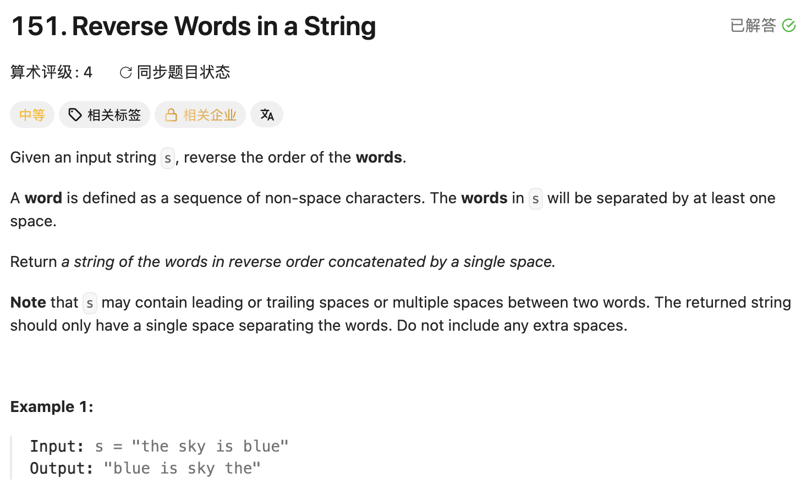

## 151. Reverse Words in a String

Date: 9/24/2026
Difficulty: Medium
Tags: String, two pointers



### 一刷 (9/24/2026) ❌ 整体思路正确，卡在空格筛选和单词边界

一开始就想到：先处理空格，再写一个 reverse 函数，整体反转一次，最后调整起止位置逐词反转。实现过程中接受提示后补齐代码，不算独立一次通过。

#### ① 保留字符的 condition 把字母也挡住了

```java
if (sb.length() == 0 && c == ' ') continue;
if (sb.length() > 0 && sb.charAt(sb.length() - 1) != ' ') {
    sb.append(c); // ❌ sb 为空时，第一个字母无法加入
                  // ❌ sb 末尾是空格时，后面的字母也无法加入
}
```

**根因**：只检查 sb 的状态，没有区分当前 c 是字母还是空格。应只跳过「当前是空格，且 sb 为空或末尾已有空格」的情况，其他字符统一 append。

> **自检信号**：用 `"a b"` dry run，检查第一个字母和空格后的第一个字母能否进入 sb。

#### ② 判断空的是 s，访问的却是 sb

```java
if (c == ' ' &&
    (s.length() == 0 || sb.charAt(sb.length() - 1) == ' ')) {
    continue; // ❌ 应检查 sb.length() == 0
}
```

**根因**：s 是原输入，sb 是正在构建的结果。输入以空格开头时，s 非空但 sb 为空，原 condition 会继续访问 sb.charAt(-1)，导致越界。

> **自检信号**：访问某个 object 前，确认前面的边界 condition 检查的是同一个 object。

#### ③ reverse 的 API、交换和 pointer update

```java
char temp = sb.charAt(start);
sb.charAt(start) = sb.charAt(end); // ❌ charAt 只能读取，不能赋值
sb.charAt(end) = sb.charAt(start); // ❌ 应使用 temp，否则原值丢失
// ❌ 缺少 start++、end--，会造成 infinite loop
```

后续重写还出现了 API 拼写问题：

```java
sb.length;                  // ❌ 应为 sb.length()
sb.deleteAt(index);         // ❌ 应为 sb.deleteCharAt(index)
sb.setcharAt(index, value); // ❌ 应为 sb.setCharAt(index, value)
```

**根因**：不熟悉 StringBuilder 的修改 API；交换需要暂存原值，每轮还必须缩小处理范围。

> **自检信号**：交换后检查两个原值是否都保留，并确认两个 pointer 向中间移动。

#### ④ 最后一个单词没有空格触发反转

逐词扫描时卡住，不理解为什么 i 要走到 sb.length()。

**根因**：空格能标记前一个单词结束，但最后一个单词后没有空格。需要把 i == length 也作为结束信号，反转 `[start, i - 1]`；此时不能读取 charAt(i)。

> **自检信号**：检查「处理动作由分隔符触发」的 loop，最后一段有没有单独的收尾入口。

**自测点**：为什么 `i <= sb.length()` 在这里不会越界？交换 `||` 两侧的 condition 后，还安全吗？

---

<!-- ↓↓↓ 复习时先自己想一遍，再往下翻看答案 ↓↓↓ -->

### 核心思路

**整体反转改变单词顺序，也颠倒单词内部字符；逐词反转再恢复内部顺序。**

```text
原输入：     "  the   sky is  blue "
整理空格：   "the sky is blue"
整体反转：   "eulb si yks eht"
逐词反转：   "blue is sky the"
```

### 正确写法

```java
class Solution {
    public String reverseWords(String s) {
        StringBuilder sb = new StringBuilder();

        // 1. 去掉开头空格，合并连续空格
        for (int i = 0; i < s.length(); i++) {
            char c = s.charAt(i);

            if (c == ' ' &&
                (sb.length() == 0 || sb.charAt(sb.length() - 1) == ' ')) {
                continue;
            }

            sb.append(c);
        }

        // 去掉结尾空格；合并后最多剩一个，用 if 也可以
        while (sb.length() > 0 && sb.charAt(sb.length() - 1) == ' ') {
            sb.deleteCharAt(sb.length() - 1);
        }

        // 2. 整体反转
        reverse(sb, 0, sb.length() - 1);

        // 3. 逐词反转
        int start = 0;
        for (int i = 0; i <= sb.length(); i++) {
            if (i == sb.length() || sb.charAt(i) == ' ') {
                reverse(sb, start, i - 1);
                start = i + 1;
            }
        }

        return sb.toString();
    }

    private StringBuilder reverse(StringBuilder sb, int start, int end) {
        while (start < end) {
            char temp = sb.charAt(start);
            sb.setCharAt(start, sb.charAt(end));
            sb.setCharAt(end, temp);
            start++;
            end--;
        }
        return sb;
    }
}
```

reverse 直接修改传入的 sb，调用时不必重新赋值。返回 sb 可以，但不是必须，也可以将 return type 改为 void。

### 两个 condition 的理解

**跳过多余空格：`A && (B || C)`**

当前是空格，并且「sb 为空，或者末尾已经是空格」，才跳过。字母不满足 A，会正常 append。

sb 为空时，`||` 左侧为 true，右侧不执行，避免访问 charAt(-1)。

**处理单词结尾：`i == length || charAt(i) == ' '`**

到达结尾，或者遇到空格，就反转前一个单词。

i == length 时左侧为 true，右侧不执行，避免越界。因此两个 condition 的顺序不能交换。

### 复杂度分析

设 n = s.length()。

**Time: O(n)**：整理空格、整体反转、逐词扫描及反转各为 O(n)，相加仍是 O(n)。每个字符都需要读取，Time 已最优。

**Space: O(n)**：StringBuilder 和最终输出均需要 O(n) 空间。Java String 不可修改，因此这里新建可修改的内容。

### 沉淀

- **先明确哪些情况要跳过**：只过滤多余空格，避免把正常字母挡在 append 之外。
- **边界检查必须保护实际访问的 object**：访问 sb，就检查 sb，不能用 s 的长度代替。
- **处理分隔符时要检查最后一段**：最后一个单词没有尾随空格，需要结尾信号。
- **short-circuit 是访问保护的一部分**：先判断空或到达结尾，再读取字符。
- **反转范围统一用闭区间**：整体是 `[0, length - 1]`，单词是 `[start, i - 1]`。

### 关联

- LC6：同样使用 StringBuilder；charAt 读取字符，setCharAt 修改字符，append 追加内容。
- LC80：初始化和访问都要检查前提；不能假设所需的位置一定存在。
