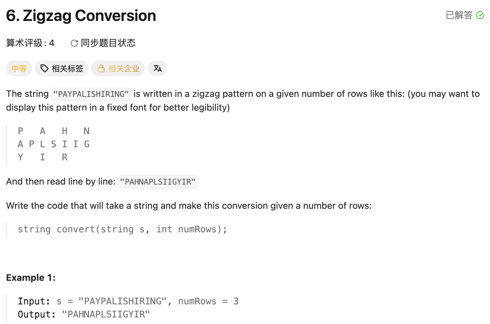

## 6. Zigzag Conversion

Date: 9/23/2026, 9/24/2026
Difficulty: Medium
Tags: String, Simulation



### 一刷 (9/23/2026) ❌ 未想到用 row + direction 模拟折返

看解后能解释完整流程，并正确写出 StringBuilder array 的初始化；当天未验证完整独立实现。

#### ① 用取余分配行，无法折返

```text
numRows = 3
i % numRows：0 → 1 → 2 → 0 → 1 → 2
实际 row：   0 → 1 → 2 → 1 → 0 → 1
```

**根因**：取余表达「到头后重新开始」，题目需要「到头后反向走」。同一个 row 有两种下一步，所以还需要 direction。

> **自检信号**：同一个位置无法唯一决定下一步时，检查是否少记了一项 state。

#### ② array 与其中的 object 要分别创建

```java
StringBuilder rows = new StringBuilder[numsRow];
// ❌ 左侧缺 []；参数名应为 numRows
```

**根因**：rows 是 StringBuilder reference 的 array。创建 array 后各格为 null，还要分别放入 new StringBuilder()。

> **自检信号**：调用 rows[i].append(...) 前，确认这一格已经指向实际 object。

#### ③ 混淆位置与方向

```java
int direction = 0;
if (direction == 0) {
    // ❌ 应检查 row 是否到顶部；direction=0 表示不移动
}
```

**根因**：row 表示当前行，direction 只取 +1 / -1。位置到达两端才改变方向，中间保持原方向。

> **自检信号**：每轮按「放当前字符 → 判断方向 → 移到下一行」检查执行顺序。

#### ④ 只有一行时，没有移动空间

讨论中确认：若省略 numRows == 1 的处理，`s="AB"` 时，放完 A 后 row 变成 1，下一轮访问 rows[1] 越界。

**根因**：这套上下移动逻辑要求至少两行；只有一行时结果就是原 string。

> **自检信号**：写到 row += direction，检查下一次访问是否合法；先用最小行数 dry run。

**自测点**：输入按原顺序扫描，为什么每行 append 后的字符顺序就是最终需要的读取顺序？

---

### 二刷 (9/24/2026) ❌ 将整个 array 传给 append，未逐行拼接

本次正确写出初始化、row + direction 折返及单行处理；自己定位到 result 拼接处有问题。

```java
StringBuilder result = new StringBuilder();
result.append(rows); // ❌ 追加 array 的标识，不是各行内容
```

**根因**：rows 是 StringBuilder[]，传入时调用 append(Object)，使用的是 array 的 toString()，不会自动遍历其中的 element。应通过 loop 逐行执行 result.append(rows[i])。

> **自检信号**：调用 append 前，检查传入的是整个 array，还是其中一行的 StringBuilder。

**自测点**：如果某一行没有分到字符，最后按行拼接是否需要跳过它？为什么？

---

<!-- ↓↓↓ 复习时先自己想一遍，再往下翻看答案 ↓↓↓ -->

### 正确写法

**每行一个 StringBuilder，按折返路线放字符，最后按行拼接。**

```java
class Solution {
    public String convert(String s, int numRows) {
        if (numRows == 1) return s;

        StringBuilder[] rows = new StringBuilder[numRows];
        for (int i = 0; i < numRows; i++) {
            rows[i] = new StringBuilder();
        }

        int row = 0;
        int direction = 1;

        for (int i = 0; i < s.length(); i++) {
            rows[row].append(s.charAt(i));

            if (row == 0) {
                direction = 1;
            } else if (row == numRows - 1) {
                direction = -1;
            }

            row += direction;
        }

        StringBuilder result = new StringBuilder();
        for (int i = 0; i < numRows; i++) {
            result.append(rows[i]);
        }
        return result.toString();
    }
}
```

`rows[i]` 是第 i 行的 StringBuilder；`result.append(rows[i])` 追加该行全部字符，不会清空它。按输入顺序 append，自然保留同一行内的字符顺序。

### 复杂度分析

设 n = s.length()，R = numRows。

**Time: O(n+R)**：初始化 R 行，分配 n 个字符，再按行拼接。
**Space: O(n+R)**：R 个 StringBuilder，行内字符、result 及输出共占 O(n) 空间；多份字符只增加常数倍。

若提前处理 `numRows >= s.length()` 并返回 s，剩余情况 R < n，可将执行转换部分的 Time / Space 简写为 O(n)。
