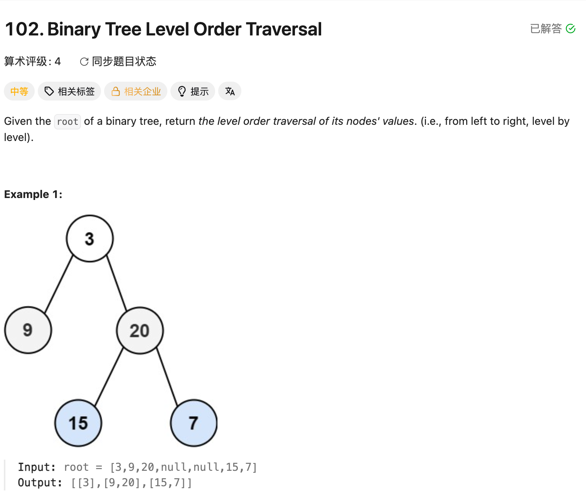

## 102. Binary Tree Level Order Traversal

Date: 9/19/2026
Difficulty: Medium
Tags: Tree, Binary Tree, Breadth-First Search, Queue



### 一刷 (9/19/2026) ❌ 没想到用 Queue 分层，看解后重写

**卡在哪**：不熟悉 Queue，不知道如何按层访问，以及如何区分当前层和下一层。

**真正的坎**：Queue 按加入顺序处理 node；**每层开始时固定 size，只处理这几个 node，新加入的 children 留给下一层。**

第一次重写，把 children 的处理放到了 for 外：

```java
for (int i = 0; i < size; i++) {
    TreeNode node = queue.poll();
    level.add(node.val);
} // ❌ 提前结束：下面也属于每个 node 要做的事

if (node.left != null) {
    queue.offer(node.left); // ❌ node 已超出 scope，compile error
}
if (node.right != null) {
    queue.offer(node.right);
}
```

**根因**：没分清「一个 node 的事」和「整层的事」。取出 node、记录 val、加入 children 都在 for 内；整层完成后才 result.add(level)。

第二次重写，逻辑正确，只剩 mechanical error：

```java
if (root == null) return reuslt; // ❌ 拼写应为 result
```

**自测点**：为什么内层 for 要使用提前保存的 size，不能每轮都用 queue.size() 判断是否结束？

---

### 核心思路（一句话）

**同一个 Queue 处理当前层、收集下一层；固定 size 决定本层处理多少个 node。**

### 三个容器各装什么

```text
queue  → 待处理的 TreeNode，需要通过它找到 children
level  → 当前层的 Integer，例如 [9,20]
result → 所有层的 List，例如 [[3],[9,20],[15,7]]
```

每轮 while 创建一个新的 level，不能把所有层写进同一个 List。

### 正确写法

```java
class Solution {
    public List<List<Integer>> levelOrder(TreeNode root) {
        List<List<Integer>> result = new ArrayList<>();
        if (root == null) return result;

        Queue<TreeNode> queue = new ArrayDeque<>();
        queue.offer(root);

        while (!queue.isEmpty()) {
            int size = queue.size(); // 当前层有多少个 node
            List<Integer> level = new ArrayList<>();

            for (int i = 0; i < size; i++) {
                TreeNode node = queue.poll();
                level.add(node.val);

                if (node.left != null) {
                    queue.offer(node.left);
                }
                if (node.right != null) {
                    queue.offer(node.right);
                }
            }

            result.add(level);
        }

        return result;
    }
}
```

### Dry run：size 把两层分开

```text
       3
      / \
     9  20
       /  \
      15   7
```

| 本层开始的 queue | 固定 size | 本层取出并记录 | 本层结束的 queue |
| ---------------- | --------: | -------------- | ---------------- |
| [3]              |         1 | [3]            | [9,20]           |
| [9,20]           |         2 | [9,20]         | [15,7]           |
| [15,7]           |         2 | [15,7]         | []               |

**Queue 在 for 中不断变化，size 不变。** 当前层全部取出后，剩下的刚好是下一层。

### API

```java
Queue<TreeNode> queue = new ArrayDeque<>();
queue.offer(root);          // 尾部加入
TreeNode node = queue.poll(); // 头部取出并移除
queue.size();               // 当前数量
queue.isEmpty();            // 是否为空
```

普通 Queue 是 FIFO；存的是 node reference，不只是 val。加入 children 前检查 null，ArrayDeque 不允许存 null。

### 复杂度分析

**Time: O(n)**：每个 node 加入、取出各一次。
**Extra space: O(w)**：w 是 tree 的最大层宽，Queue 最多保存相邻两层的部分 node，仍为 O(w)；最坏 O(n)。
**Result space: O(n)**：所有 node 的 val 各保存一次。

### 沉淀

- **分层 BFS：外层 while 管一层，内层 for 管这一层的每个 node。**
- **先固定 size，再加入 children**：新加入的 node 不属于当前层。
- **处理 children 也是当前 node 的事**：必须放在 for 内。
- **先加 left，再加 right**：保证每层从左到右输出。
