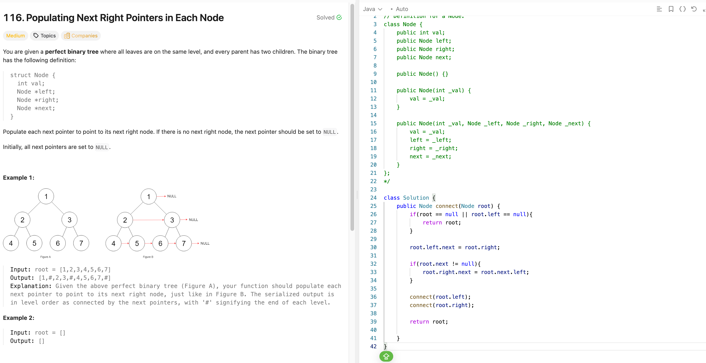

## 116. Populating Next Right Pointers in Each Node
Date: 1/21/2026  
Difficulty: Medium  
Tags: Tree/BFS/Recursion  



### My first intuition (BFS / level order)
- Background: just learned DFS/BFS, so I naturally reached for a queue.
- Works, but uses extra space: O(n).

### Recursive solution (clean & elegant)

### Core invariants (Perfect Binary Tree only)
For each node `root`:
1. `root.left.next = root.right`
2. If `root.next != null`, then `root.right.next = root.next.left`

### Java code
method 1: Recursion
```java
class Solution {
    public Node connect(Node root) {
        if (root == null || root.left == null) return root;

        root.left.next = root.right;
        if (root.next != null) {
            root.right.next = root.next.left;
        }

        connect(root.left);
        connect(root.right);
        return root;
    }
}
```
### Complexity
- Time: O(n)
- Space: O(1) extra (recursion stack excluded)

### Key takeaway:
- Recursion works only because the tree is perfect.
- Focus on structural guarantees, not just traversal methods.

method 2: Queue/BFS
```java
class Solution{
  public Node connect(Node root){
    if (root == null) return null;

    Deque<Node> deque = new ArrayDeque<>();
    deque.offerLast(root);

    while(!deque.isEmpty()){
      int size = deque.size();
      Node prev = null;

      for(int i = 0; i < size; i++){
        Node cur = deque.pollFirst();

        if(prev != null) prev.next = cur;
        prev = cur;

        if (cur.left != null) deque.offerLast(cur.left);
        if (cur.right != null) deque.offerLast(cur.right);
      }
    }
    return root;
  }
}
```
### Complexity
- Time: O(n)
- Space: O(n)