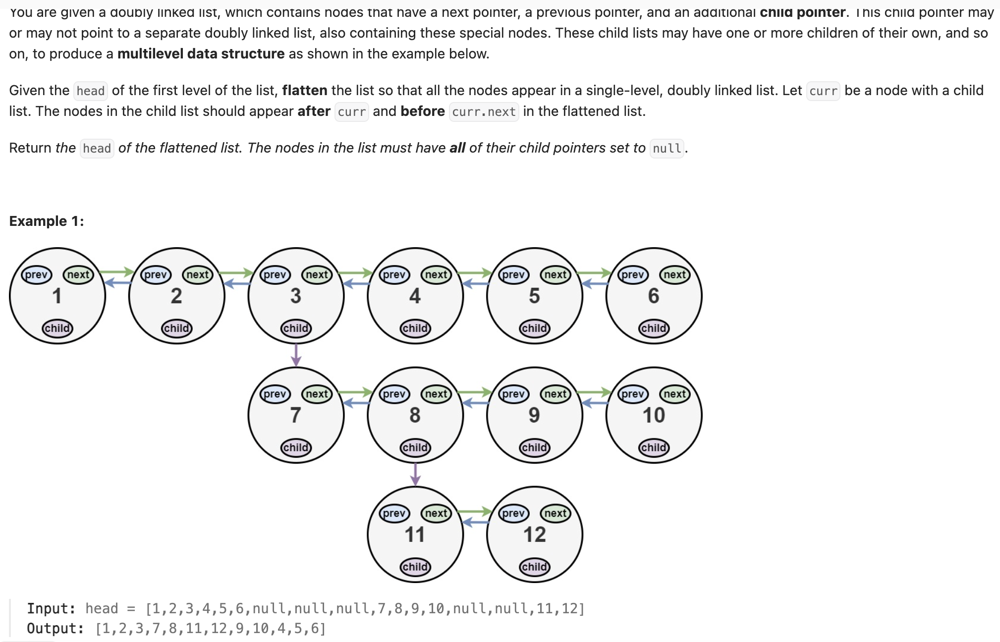

## 430. Flatten a Multilevel Doubly Linked List

Date: 9/20/2026
Difficulty: Medium
Tags: Linked List, DFS, Recursion



### 一刷 (9/20/2026) ❌ 顺序能理解，递归与 reference 连接难以落到代码

**卡在哪**：知道要把 child 插到当前 node 后面，也想到保存原来的 next，但没串起「展开 child → 找 tail → 接回 next」。

初稿的关键错误：

```java
Node curNodeHasChild = findChild(Node head); // ❌ 调用只传 head，不写类型
Node afterChild = cur.next;                 // ❌ helper 的局部 cur 在这里不可见

while (node.child = null) { // ❌ 判断用 ==；= 是赋值，这里也不产生 boolean
    cur = next;            // ❌ next 尚未声明；沿链移动用 cur.next
}
```

看解后重写，连接顺序正确，但找 tail 多走了一步：

```java
Node tail = childHead;
while (tail != null) { // ❌ 最后走到 null，没有停在最后一个 node
    tail = tail.next;
}
tail.next = next;      // ❌ NullPointerException
```

**根因**：遍历到结束与找到最后一个 node，停止位置不同。`4 → 5 → null` 中，要停在 5，condition 应为 `tail.next != null`。

**自测点**：如果带 child 的 node 本来就是当前链的末尾，接回 next 的两行中，哪一行需要判 null，为什么？

---

### 核心思路

**保存原来的 next → 递归展开 child → 接上 child head → 用 child tail 接回 next。**

```text
原来：
1 ⇄ 2 ⇄ 3
    |
    4 ⇄ 5

展开后：
1 ⇄ 2 ⇄ 4 ⇄ 5 ⇄ 3
```

本题采用 LC430 的 doubly linked list 定义，next、prev 都要接好，child 最后清为 null。

### 正确写法

```java
class Solution {
    public Node flatten(Node head) {
        Node cur = head;

        while (cur != null) {
            if (cur.child == null) {
                cur = cur.next;
                continue;
            }

            Node next = cur.next;               // 保存原来的后半段
            Node childHead = flatten(cur.child); // 先展开 child 内部

            cur.next = childHead;
            childHead.prev = cur;
            cur.child = null;

            Node tail = childHead;
            while (tail.next != null) {
                tail = tail.next;
            }

            tail.next = next;
            if (next != null) {
                next.prev = tail;
            }

            cur = next; // child 已经处理完，继续原来的后半段
        }

        return head;
    }
}
```

### 操作拆解

| variable  | 职责                             |
| --------- | -------------------------------- |
| head      | 保存当前这次调用的起点，最后返回 |
| cur       | 当前处理的 node                  |
| next      | cur 原来的 next，接线前先保存    |
| childHead | 展开后的 child 起点              |
| tail      | 展开后的 child 末尾              |

连接前后：

```text
cur ⇄ next       childHead ⇄ … ⇄ tail
                  ↓
cur ⇄ childHead ⇄ … ⇄ tail ⇄ next
```

**每处连接都要补两个方向**：`cur.next / childHead.prev` 是一对，`tail.next / next.prev` 是一对。

### 递归为什么还能调用 flatten？

`cur.child` 也是一段 linked list 的 head，可以交给同一个方法处理。外层暂停，等内层把 child 整段展开后，返回它的 head，再继续接线。

```text
外层：head = 1，cur = 2，next = 3
内层：flatten(4)，有自己的一份 head、cur
内层返回 4 → 外层 childHead 指向 4，cur 仍是 2
```

各次调用的局部 variable 独立，但指向的 node 对象可以共享；内层修改的连接会保留下来。

### continue 与 return head

```java
Node cur = head;
while (cur != null) {
    // 处理当前 node，并推进 cur
}
return head;
```

- **continue**：跳过本轮剩余代码，回到 while condition；不是只退出 if，也不是退出整个 while。
- **cur 与 head 独立**：移动 cur 不会移动 head。cur 为 null 时，head 仍指向原来的第一个 node。
- **head 是入口**：它不直接保存所有 node 的 reference，而是通过各个 node 的 next 找到后面。连接改好后，返回 head 就能访问展开后的整条链。

### 复杂度分析

**Time: 最坏 O(n²)**：递归展开后又扫描寻找 tail，深层嵌套时同一段可能被多层重复扫描。
**Space: O(d)**：recursion stack，d 为嵌套深度，最坏 O(n)。

若让 helper 直接返回展开后的 tail，可避免重复扫描，优化到 O(n)。

### 沉淀

- **改 next 前，先保存之后还要用的旧 next**，否则可能丢掉后半段的入口。
- **找末尾用 tail.next != null**；遍历全部 node 通常用 cur != null。
- **移动 reference 与修改连接分开想**：`cur = next` 只移动 cur；`cur.next = childHead` 才修改链。
- **先搭遍历框架，再填处理逻辑**；每条 loop 路径都必须推进或退出。

### 关联

- LC206 / LC237：同样要区分移动局部 reference 与修改 node.next。
- LC98：递归返回 boolean 用于判断；本题递归返回展开后的 head，用于继续接线。
