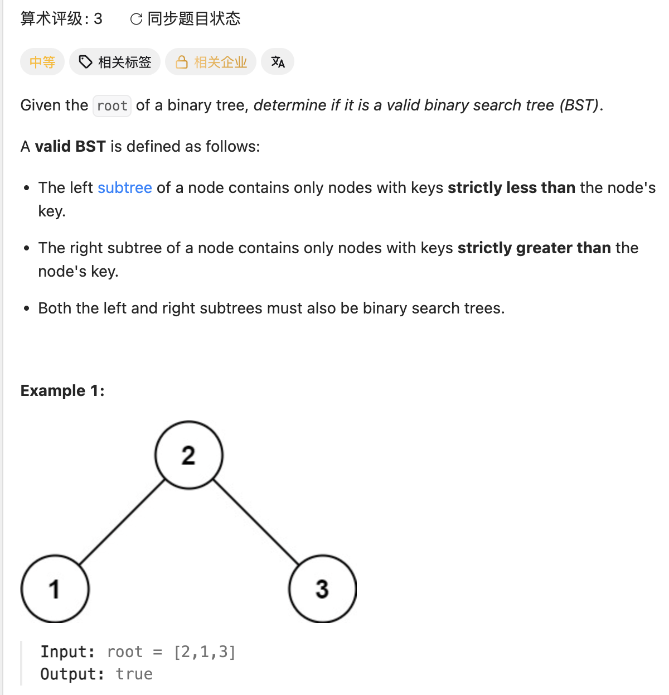

## 98. Validate Binary Search Tree

Date: 9/20/2026
Difficulty: Medium
Tags: Binary Tree, DFS, Recursion



### 本轮 (9/20/2026) ❌ 只检查 parent / child，遗漏 ancestor 的限制

初稿的关键片段：

```java
if (root.left.val < root.val) { // ❌ child 可能为 null
    valid(root.left);          // ❌ 没使用返回值，false 无法向上传递
}

while (node.left != null || node.right != null) {
    int leftValue = node.left.val;   // ❌ || 只保证至少一个 child 存在
    int rightValue = node.right.val;

    if (leftValue >= node.val || rightValue < node.val) {
        return false; // ❌ right 相等也不合法，应为 <=
    }
    return true; // ❌ 第一轮就结束，没有继续向下检查
}
```

**核心错误**：BST 的「左小右大」约束整个 subtree，不只是直接的 child。即使修好 null、比较方向和返回值，只检查相邻 node 仍然不够。

```text
       5
        \
         8
        /
       4
```

`8 > 5`、`4 < 8` 都成立，但 4 在 5 的 right subtree 中，必须同时满足 `4 > 5`，所以不合法。

**自测点**：面试官问：一条路径上可能有很多 ancestor，为什么只传 lower、upper 两个值，就能保留所有 ancestor 的限制？

---

### 核心思路

**每个 node 必须严格落在 (lower, upper) 内；去 left 更新 upper，去 right 更新 lower。**

```text
              node.val
           (lower, upper)
             /       \
 (lower, node.val)   (node.val, upper)
```

### 正确写法

```java
class Solution {
    public boolean isValidBST(TreeNode root) {
        return valid(root, Long.MIN_VALUE, Long.MAX_VALUE);
    }

    private boolean valid(TreeNode node, long lower, long upper) {
        if (node == null) return true;

        if (node.val <= lower || node.val >= upper) {
            return false;
        }

        return valid(node.left, lower, node.val)
            && valid(node.right, node.val, upper);
    }
}
```

### 本次要记住的三点

- **范围保留 ancestor 的限制**：lower 是已遇到的下界中最严格的，upper 是上界中最严格的；合法范围是这些限制的交集。
- **每次调用有自己的 parameter**：root 为 5 时，left 收到 `(Long.MIN_VALUE, 5)`，right 收到 `(5, Long.MAX_VALUE)`。调用 left 不会修改 root 这次调用的 upper。
- **边界用 long，node.val 仍用 int**：合法 node 可能等于 `Integer.MIN_VALUE` / `MAX_VALUE`；用 int 极值作为严格边界，会误判这些合法值。

### 递归顺序与返回值

**DFS，preorder：中 → 左 → 右。** 先检查当前 node，再递归检查左右 subtree。

`return 左 && 右` 才能把递归结果向上传递；左边 false 时短路，不再检查右边。没有 node 就没有违规，所以 null 返回 true。

### 复杂度分析

**Time: O(n)**：每个 node 最多检查一次。
**Space: O(h)**：recursion stack 最多保存树高 h 层；平衡时 O(log n)，退化成链时 O(n)。

只比较 parent / child 会漏判；对每个 node 重新扫描全部 descendant，最坏 O(n²)。传递上下界避免了重复扫描。

### 沉淀

- **递归不仅传 node，也可以传它必须遵守的条件。**
- **boolean helper 的返回值必须参与判断或 return**，只调用不会自动让外层失败。
- **读 `.val` 前先确认 node 非 null**；`left != null || right != null` 不代表两个 child 都存在。

### 关联

- LC102：BFS 用 Queue 逐层处理；本题 DFS 用递归深入，并携带 ancestor 的范围限制。
