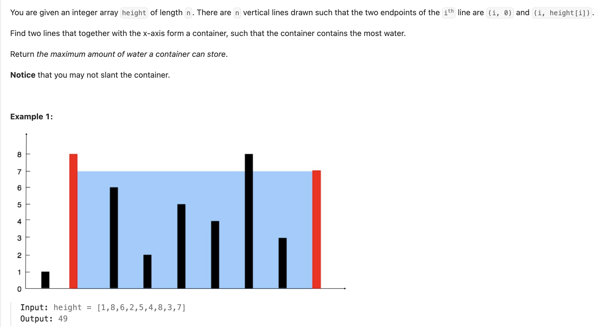

## 11. Container With Most Water

Date: 10/9/2026  
Difficulty: Medium  
Tags: Array, Two Pointers, Greedy



### 一刷 (10/9/2026) ⚠️ 独立写出思路，修正 width 后 AC

从 LC42 的 two pointers 思路迁移，独立写出 running maximum 版本。最初 width 写成：

```java
int width = right - left - 1; // ❌ 把 LC42 monotonic stack 的 width 公式带过来了
```

**根因**：LC42 的 stack 解法计算两侧 bars 之间有多少个 columns，因此减 1；LC11 计算两条线之间的距离，应为 `right - left`。自己修正后 AC。

原代码还保留了 LC42 的写法：

```java
prefix = Math.max(prefix, height[left]);
sufix = Math.max(sufix, height[right]);
```

该版本 AC，time / space 同样为 O(n) / O(1)，但 running maximum 可能来自之前的位置，与当前 width 不一定对应同一个实际容器。标准写法直接使用当前两端的 height，更容易解释。

原 `left <= right` 不影响结果：相遇时 width 为 0。改为 `<`，只处理两条不同的线。

> **自检信号**：写 width 前，先问是在算“两点之间的距离”，还是“排除两端后剩多少个 elements”。

**自测点**：保留较短的一侧，只把较高的一侧向内移动，为什么不可能得到更大的面积？

---

<!-- ↓↓↓ 复习时先自己想一遍，再往下翻看答案 ↓↓↓ -->

### 核心思路（一句话）

**从两端开始计算面积，每次移动较短的一侧，保留遇到的最大面积。**

### 正确写法

```java
class Solution {
    public int maxArea(int[] height) {
        int left = 0, right = height.length - 1;
        int ans = 0;

        while (left < right) {
            int width = right - left;
            int area = Math.min(height[left], height[right]) * width;
            ans = Math.max(ans, area);

            if (height[left] < height[right]) {
                left++;
            } else {
                right--;
            }
        }

        return ans;
    }
}
```

### 为什么移动较短的一侧

假设 `height[left] < height[right]`：

- 当前面积受 `height[left]` 限制。
- 保留 left，只向内移动 right，width 会变小。
- 无论新的 right 多高，容器高度都不会超过 `height[left]`。

因此，当前 left 与剩余范围内其他 right 的组合，都不可能超过刚计算的面积，可以排除当前 left。

**移动较短的一侧只是保留找到更大面积的可能，不保证下一次面积一定更大。** 因此需要持续用 `Math.max` 更新 ans。

两端等高时，移动任意一侧即可。

### Width 为什么不减 1

```text
left = 0，right = 2

两条线之间的距离：2 - 0 = 2
两端之间的 elements 数量：2 - 0 - 1 = 1
```

本题要的是距离：

```java
int width = right - left;
```

### 与 LC42 的区别

|               | LC11                   | LC42 two pointers                         |
| ------------- | ---------------------- | ----------------------------------------- |
| 目标          | 选择两条线，求最大面积 | 计算所有位置的总接水量                    |
| 使用的 height | 当前两端的 height      | 两侧 running maximum                      |
| 本轮计算      | 较短 height × width    | 限制 water level 的 maximum − 当前 height |
| 更新答案      | `Math.max(ans, area)`  | `ans += water`                            |

**LC11 不需要减去中间的 bar heights。** 题目选择的是两条线组成的容器，中间的线不作为占据容器空间的柱子计算。

### 复杂度分析

**Time: O(n)**：每轮移动一个 pointer，两个 pointers 总共最多移动 n−1 次。  
**Extra space: O(1)**：只维护固定数量的 variables。

原 running maximum 版本同样是 O(n) time / O(1) extra space；标准写法省去两个 variables 和每轮的 maximum update，区别只是常数开销。

对比 brute force O(n²)：brute force 检查所有两条线的组合；two pointers 每轮根据较短的一侧排除一个 endpoint。

### 沉淀

- **Width 的公式由测量对象决定。** 距离用 `right - left`；两端之间的 element 数量才减 1。
- **先计算当前面积，再排除较短的一侧。** 排除依据是保留它无法得到更好的答案。
- **Two pointers 不等于固定模板。** LC11 使用当前 height；LC42 需要 running maximum。
- **本题求最大值，不是累加。** 每次计算一个候选容器，用 Math.max 保留最佳答案。

### 关联

- LC42：都受较短 boundary 限制，但计算对象与 width 含义不同。
- LC167：同样通过比较结果排除一个 endpoint；pointer 的移动方向需要具体推导。

### Interview pitch

> "I start with two pointers at opposite ends. The area is the distance between them multiplied by the shorter height.
>
> After updating the maximum area, I move the pointer at the shorter line. Keeping that line and moving the other pointer inward would reduce the width without increasing the limiting height, so it cannot produce a larger area.
>
> I continue until the pointers meet. The time complexity is O(n), and the extra space is O(1)."
