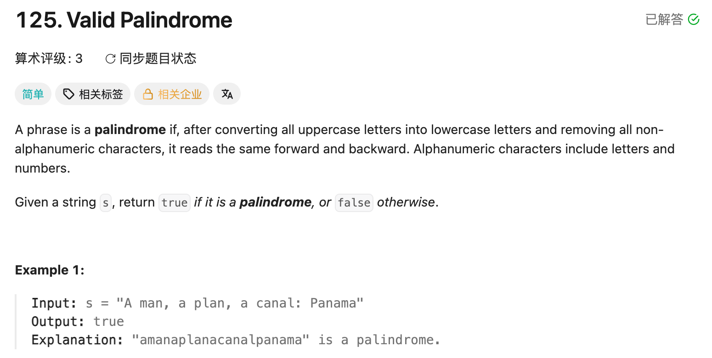

## 125. Valid Palindrome

Date: 9/18/2026
Difficulty: Easy
Tags: String, Two Pointers



### 一刷 (9/18/2026) ❌ 跳过逻辑放错层级，右 pointer 方向写反

最初能写出两端比较，但不知道如何处理非字母、非数字字符。

第一次补写：

```java
while (l < r && !Character.isLetterOrDigit(s.charAt(l))) {
    l++;
}
while (l < r && !Character.isLetterOrDigit(s.charAt(r))) {
    r--;
}

while (l < r) {
    // ❌ 跳过逻辑放在外面，只处理最开始的两端
    // 比较后向中间移动，仍可能遇到无效字符
}
```

**根因**：跳过无效字符是每次比较前的准备，不是一次性初始化。例如 `"a,ba"`，比较两端的 `'a'` 后，会直接拿 `','` 和 `'b'` 比较，误判 false。

后续修订：

```java
while (left < right &&
       !Character.isLetterOrDigit(s.charAt(right))) {
    right++; // ❌ 应为 right--；向外走可能越界
}
```

**自检信号**：两个 pointer 都往中间走——左边 `++`，右边 `--`。

**自测点**：外层已经判断 `left < right`，为什么内层跳过字符时仍需要判断？用 `"!!!"` 说明。

---

<!-- ↓↓↓ 复习时先自己想一遍，再往下翻 ↓↓↓ -->

### 正确写法

不需要真正删除字符，移动 pointer 跳过即可。

```java
class Solution {
    public boolean isPalindrome(String s) {
        int left = 0, right = s.length() - 1;

        while (left < right) {
            while (left < right &&
                   !Character.isLetterOrDigit(s.charAt(left))) {
                left++;
            }

            while (left < right &&
                   !Character.isLetterOrDigit(s.charAt(right))) {
                right--;
            }

            if (Character.toLowerCase(s.charAt(left))
                    != Character.toLowerCase(s.charAt(right))) {
                return false;
            }

            left++;
            right--;
        }

        return true;
    }
}
```

**每轮顺序：跳过无效字符 → 忽略大小写比较 → 两端向中间移动。**

### 为什么内层也要检查边界

外层 condition 只在进入这一轮时检查，内层移动 pointer 后不会自动重新检查外层。

对于 `"!!!"`，若内层只有「不是字母或数字就继续走」，`left` 会增加到 3，读取 `s.charAt(3)` 时越界。

```java
left < right && !Character.isLetterOrDigit(s.charAt(left))
```

`&&` 会 short-circuit：两端相遇时，前半为 false，不再执行后面的 `charAt`。

跳过后若两端相遇，后续比较的是同一个字符，不会误判。

### API 速记

| API                            | 作用                            | 返回类型 |
| ------------------------------ | ------------------------------- | -------- |
| `s.length()`                   | 获取 string 长度                | int      |
| `s.charAt(i)`                  | 获取 index i 的字符             | char     |
| `Character.isLetterOrDigit(c)` | 判断是否为字母或数字            | boolean  |
| `Character.toLowerCase(c)`     | 返回 lowercase 字符             | char     |
| `Character.toUpperCase(c)`     | 返回 uppercase 字符，本题不需要 | char     |

```java
Character.isLetterOrDigit('7'); // true
Character.isLetterOrDigit(','); // false
Character.toLowerCase('A');     // 'a'
Character.toLowerCase('7');     // '7'
```

- **String 用 `s.length()`，array 用 `nums.length`。**
- 转换 API 返回转换后的字符，不修改原 string；没有大小写的字符原样返回。
- **char 比较用 `==` / `!=`；String 比内容用 `.equals()`。**

### 拓展：忘记 API 时怎么写

对本题的 ASCII input，可以手动判断范围：

```java
private boolean isLetterOrDigit(char c) {
    return (c >= 'a' && c <= 'z')
        || (c >= 'A' && c <= 'Z')
        || (c >= '0' && c <= '9');
}

private char toLower(char c) {
    if (c >= 'A' && c <= 'Z') {
        return (char) (c - 'A' + 'a');
    }
    return c;
}
```

`c - 'A'` 算字母的位置，再加 `'a'` 得到对应 lowercase。它只处理 ASCII 范围，不是 Character API 的完整 Unicode 替代。

主写法优先用 API，手写作为备用。

### 复杂度分析

**Time: O(n)**：两个 pointer 单向移动，每个字符只被处理常数次；嵌套 while 不代表 O(n²)。

**Space: O(1)**：只维护两个 pointer，没有创建过滤后的 string。

### 沉淀

- **跳过逻辑属于每轮比较，放在外层 loop 里面。**
- **内层移动 pointer，也要有自己的边界保护。**
- **对撞 pointers 的方向固定：左 ++，右 --。**
- **不匹配可以立即返回 false；全部检查完才能返回 true。**
