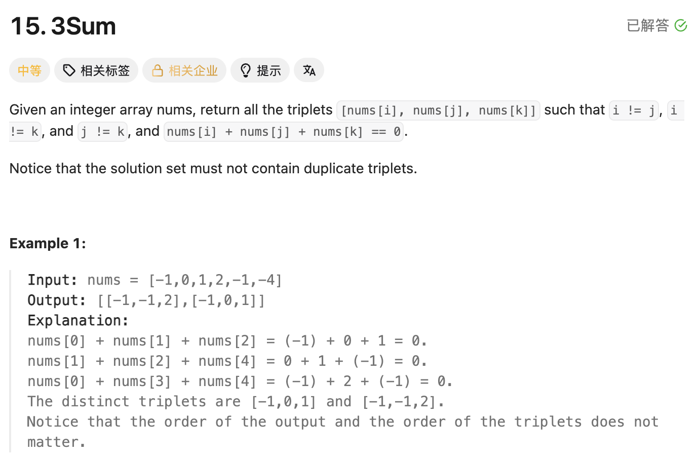

## 15. 3Sum

Date: 10/9/2026  
Difficulty: Medium  
Tags: Array, Two Pointers, Sorting



### 一刷 (10/9/2026) ❌ 没有独立思路；看解后重写，遗漏 pointer update 和去重位置

**卡在哪**：不知道如何同时寻找三个数。讲解后理解：先固定 `nums[i]`，再在右侧找和为 `-nums[i]` 的两个数。

第一次照着答案重写：

```java
for (int i = 0; i < nums.length - 2;) {
    // ❌① 漏 i++，外层无法推进，continue 也不会改变 i

    // ...

    } else {
        ans.add(Arrays.asList(nums[i], nums[left], nums[right]));
        // ❌② 漏 left++ / right--，可能反复记录同一组答案
    }

    // ❌③ 去重放在 else 外面，right 可能还没有移动
    while (left < right && nums[left] == nums[left - 1]) {
        left++;
    }
    while (left < right && nums[right] == nums[right + 1]) {
        right--; // right 仍在末尾时，right + 1 越界
    }
}
```

**根因**：没有把「记录答案 → 两侧移动 → 跳过重复 values」连成一个完整步骤。相邻位置的比较依赖前面的 pointer update，不能把去重单独搬出去。

例如 `[-3,0,1,1]`：第一轮 sum < 0，left 移到 index 2，right 仍为 3；随后访问 `nums[right + 1]`，即 `nums[4]`，发生越界。

同日再次重写，上述三处均修正，只剩 API 拼写错误：

```java
ans.add(Arrays.isList(nums[i], nums[left], nums[right]));
// ❌ 应为 Arrays.asList(...)
```

这是看解后的同日重写，不记为独立解出；未报告修正后的 AC 结果。

> **自检信号**：逐个 branch 检查 pointer 是否推进；找到答案后，确认先移动，再与刚用过的 value 比较。

**自测点**：为什么外层跳过重复值可以用 continue，而内层去重必须显式写 left++ / right--？如果内层只写 continue，会发生什么？

---

<!-- ↓↓↓ 复习时先自己想一遍，再往下翻看答案 ↓↓↓ -->

### 核心思路（一句话）

**Sorting 后固定一个数，在它右侧用 two pointers 找另外两个数，并跳过重复的 value 组合。**

```text
nums[i] + nums[left] + nums[right] = 0

固定 nums[i] 后：
nums[left] + nums[right] = -nums[i]
```

### 正确写法

```java
class Solution {
    public List<List<Integer>> threeSum(int[] nums) {
        Arrays.sort(nums);
        List<List<Integer>> ans = new ArrayList<>();

        for (int i = 0; i < nums.length - 2; i++) {
            if (nums[i] > 0) {
                break;
            }

            if (i > 0 && nums[i] == nums[i - 1]) {
                continue;
            }

            int left = i + 1;
            int right = nums.length - 1;

            while (left < right) {
                int sum = nums[i] + nums[left] + nums[right];

                if (sum < 0) {
                    left++;
                } else if (sum > 0) {
                    right--;
                } else {
                    ans.add(Arrays.asList(
                        nums[i], nums[left], nums[right]
                    ));

                    left++;
                    right--;

                    while (left < right
                            && nums[left] == nums[left - 1]) {
                        left++;
                    }

                    while (left < right
                            && nums[right] == nums[right + 1]) {
                        right--;
                    }
                }
            }
        }

        return ans;
    }
}
```

### 三个阶段分别做什么

**① 固定第一个数**

- `i < nums.length - 2`：右侧至少留下两个位置。
- `nums[i] > 0`：后面的数都不小于它，三个数不可能加成 0，可以结束。
- 当前 value 与上一轮相同：跳过，避免重复搜索。

**② 用 two pointers 找另外两个数**

- `left = i + 1`：不重复使用 i。
- `left < right`：另外两个 indices 也必须不同。
- sum < 0：当前 left 配右侧最大的可用 value 仍不够，排除 left。
- sum > 0：当前 right 配左侧最小的可用 value 仍太大，排除 right。

**③ 找到答案后**

```text
记录 triplet → left++、right-- → 跳过刚用过的重复 values
```

固定 i 后，找到一个配对就确定了两个 values。继续使用其中相同的 value，只会再次得到同一个 triplet，因此跳过。

### Duplicate triplets 怎么定义

**按 values 判断，不按 indices 判断；顺序不同也算重复。**

```text
[-1,0,1] 和 [-1,1,0] → 同一个 triplet
```

例如：

```text
nums = [-1,-1,0,1]

indices (0,2,3) → [-1,0,1]
indices (1,2,3) → [-1,0,1]
```

两组 indices 不同，但返回的 values 相同，只能记录一次。

一个 triplet 内可以有相同的 values：

```text
[-1,-1,2] // 合法，但两个 -1 必须来自不同 indices
```

因此不能先把 input 全部去重，否则会丢掉这种答案。

### 为什么外层用 continue，内层用 ++ / --

外层使用 for：

```java
for (int i = 0; i < nums.length - 2; i++) {
    if (i > 0 && nums[i] == nums[i - 1]) {
        continue;
    }
}
```

执行 continue 后，仍会执行 for 的 update statement，也就是 `i++`。

内层使用 while，没有自动推进：

```java
while (left < right && nums[left] == nums[left - 1]) {
    left++;
}
```

如果这里只写 continue，left 不变，condition 也不变，就会 infinite loop。

**Continue 只跳过本轮剩余代码，不负责改变 pointer。**

### 为什么比较 left - 1 和 right + 1

找到答案后，先执行：

```java
left++;
right--;
```

因此：

- `left - 1` 是刚刚用过的左侧位置。
- `right + 1` 是刚刚用过的右侧位置。

再与它们比较，跳过相同 values。连续跳过时，相邻的重复值会继续保持相等。

### Arrays.asList()

```java
ans.add(Arrays.asList(nums[i], nums[left], nums[right]));
```

`Arrays.asList(...)` 把三个 values 组成一个 `List<Integer>`，再加入外层 ans。

```text
as List = 组成 List
```

返回的内层 List 是 fixed-size：可以 set，不能 add / remove 改变 size。外层 ans 是 ArrayList，可以继续加入新的 triplets。

### 复杂度分析

设 n = nums.length，k = 返回的 triplets 数量。

**Time: O(n²)**：

- Sorting：O(n log n)。
- 外层每换一个 i，left / right 都重新初始化，再扫描右侧范围。
- 各轮最多移动的次数合计：

```text
(n−2) + (n−3) + … + 1 = O(n²)
```

因此总 time 为：

```text
O(n log n) + O(n²) = O(n²)
```

去重和提前 break 能减少部分输入的工作量，不改变最坏复杂度。

**Extra space**：

- Two pointers 搜索本身：O(1)，不含排序和返回结果。
- 排序的额外开销取决于 Java Arrays.sort 的具体实现。
- 返回结果：O(k)，最坏 O(n²)。

### 沉淀

- **三个数可以拆成固定一个，再找两个。**
- **每个 branch 都要检查推进。** 找到答案也必须移动 pointers。
- **去重与 pointer update 是配套的。** 先移动，才能用相邻位置识别刚用过的 value。
- **相同 values 可以出现在同一答案中，相同 triplet 不能重复返回。**
- **Sorting 是 O(n log n)，不是 O(log n)。** 本题更大的开销来自反复执行 two pointers 扫描。

### 关联

- LC417：同样用 Arrays.asList，把多个 values 组成一个 List 加入答案。
- LC128：需要区分“去重 values”和“去重答案”；本题不能直接用 HashSet 删除 input 中的重复值。
- LC11：two pointers 向内推进，但本题每换一个 i 都会重新扫描。

### Interview pitch

> "First, I sort the array. Then I fix one number and use two pointers to find two numbers to its right whose sum equals the negative of the fixed number.
>
> If the total is too small, I move left forward. If it is too large, I move right backward. When I find a triplet, I record it, move both pointers inward, and skip duplicate values.
>
> I also skip duplicate values for the fixed number, so each unique triplet is returned once. The overall time complexity is O(n²)."

面试澄清：

> "Just to clarify, triplets are considered duplicates if they contain the same values, regardless of their indices or order. Is that correct?"
