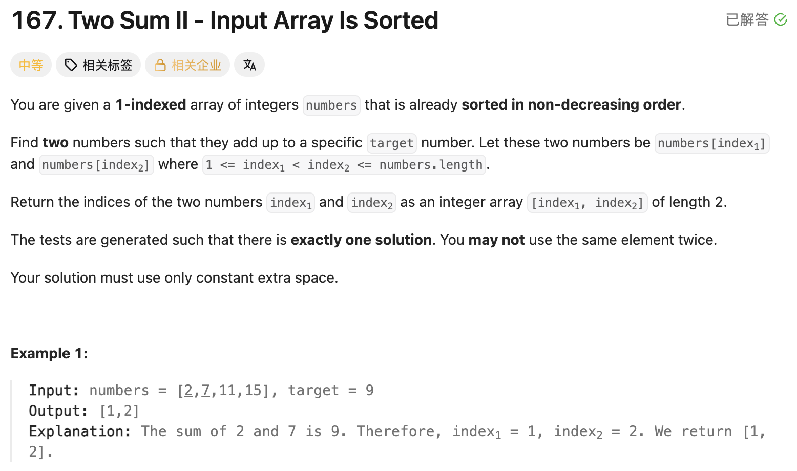

## 167. Two Sum II - Input Array Is Sorted

Date: 9/29/2026, 10/9/2026  
Difficulty: Medium  
Tags: Array, Two Pointers



### 一刷 (9/29/2026) ❌ 比较两端之和，却用 mid 更新 pointer

```java
while (left <= right) { // ❌① 不能重复使用同一个 element，应为 <
    int mid = left + (right - left) / 2;

    if (numbers[left] + numbers[right] == target) {
        return int[]{left + 1, right + 1};
        // ❌② Java 创建 array 需要 new int[]{...}
    } else if (numbers[left] + numbers[right] > target) {
        right = mid - 1; // ❌❌③ 核心错误：只能排除当前 right，不能跳过半段
    } else {
        left = mid + 1; // ❌③ 同上：只能排除当前 left
    }
}
// ❌④ method 末尾缺少 return，无法编译
```

**根因**：两端之和只能证明某个端点不能参与剩余答案，没有证明半个区间都不可用。把 binary search 的 `mid ± 1` 搬过来，会跳过合法答案。

反例：`numbers = [1,2,3,4,6]`，target = 6。初始 `1+6>6`，mid = 2；执行 `right = mid - 1` 后 right = 1，把答案中的 4 直接排除了。

> **自检信号**：更新 pointer 前，指出这次比较到底排除了哪些候选；只能排除一个端点，就只移动一格。

**自测点（当时）**：当两端之和大于 target 时，为什么能排除当前 right，却不能排除当前 left？

---

### 二刷 (10/9/2026) ✅ 一次 AC；相遇 condition 仍写成 <=

独立使用 `left++ / right--`，没有再用 mid 跳过半段；`new int[]{...}`、末尾 return 和 1-based indices 均正确。能主动指出需要利用 sorted input。

```java
while (left <= right) { // ⚠️ 相遇时会重复使用同一个 element，应为 <
```

**根因**：一刷的相遇 condition 再次出现。本题保证存在答案，正确的 pointer update 会在相遇前找到答案，因此本次仍然 AC；`left < right` 才直接表达两个 indices 必须不同。

口述时将解法称为「two pointers 和 binary search 的结合」。讨论后澄清：本写法每轮排除一个端点，属于 two pointers；没有使用 midpoint 或排除半个区间。

> **自检信号**：写 loop condition 前，先检查 `left == right` 是否仍是合法候选；判断算法时看比较与排除方式，不只看 input 是否 sorted。

本轮记录一次 AC；pointer 排除依据已在讲解中给出，不据此记为独立口答通过。

---

<!-- ↓↓↓ 复习时先自己想一遍，再往下翻看答案 ↓↓↓ -->

### 正确写法

```java
class Solution {
    public int[] twoSum(int[] numbers, int target) {
        int left = 0, right = numbers.length - 1;

        while (left < right) {
            int sum = numbers[left] + numbers[right];

            if (sum == target) {
                return new int[]{left + 1, right + 1};
            } else if (sum > target) {
                right--;
            } else {
                left++;
            }
        }

        return new int[]{-1, -1};
    }
}
```

- **sum > target**：left 已是剩余范围内最小的值，配当前 right 都太大，换其他候选只会更大或相等，因此排除当前 right。
- **sum < target**：right 已是剩余范围内最大的值，配当前 left 都太小，换其他候选只会更小或相等，因此排除当前 left。
- **left < right**：两个 indices 必须不同；返回时加 1，转换为题目要求的 1-based indices。

题目保证有解，末尾 return 用于补全 method 的返回路径。

### 复杂度分析

**Time: O(n)**：每轮移动一个 pointer，范围缩小一格，总共最多移动 n−1 次。  
**Extra space: O(1)**：只维护固定数量的 variables，返回 array 大小也固定。

### 一题多解：逐个固定 + binary search

固定 `numbers[i]`，在右侧范围 `[i + 1, n - 1]` 中用 binary search 查找 `target - numbers[i]`，避免重复使用同一个 element。

**Time: O(n log n)**：最多固定 n 个 elements，每次 binary search 为 O(log n)。  
**Extra space: O(1)**：使用 iterative binary search。

当前 two pointers 解法利用两端之和逐步排除候选，不需要为每个 element 重新搜索，time 为 O(n)。

### 沉淀

- **sorted 不等于必须用 binary search。** 能否跳过半个区间，取决于比较结果是否足以排除它。
- **先说明排除依据，再决定 pointer 怎么移动。** 本题比较两端之和，每次排除一个端点。
- **同一个 element 能否重复使用，决定相遇时是否继续。** 本题要求不同 indices，因此使用 `left < right`；AC 不代表每个 condition 都准确表达了约束。

### 关联

- LC704：比较 mid 对应的值与 target，可以排除包含 mid 的一侧；LC167 比较两端之和，排除一个端点。
- LC28：两个 variables 的职责要清楚，不能因为都在操作 index 就套用同一种推进方式。
