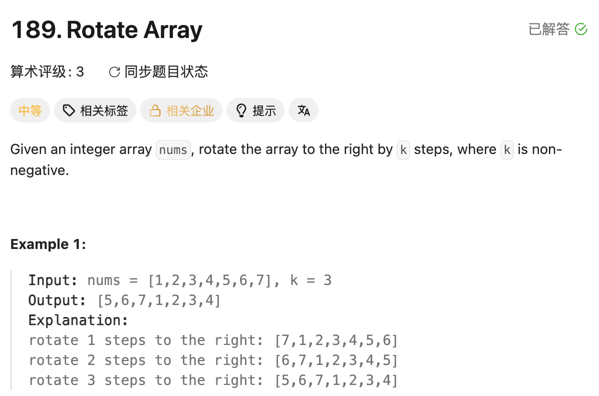

## 189. Rotate Array

Date: 7/28/2026, 8/7/2026, 8/11/2026, 9/19/2026
Difficulty: Medium
Tags: Array, In-place, Two Pointers



### 一刷 (7/28/2026) ❌ loop body 写死 index + brute force TLE

自己想到「右移 1 位，重复 k 次」，但搬运时没用上 loop variable：

```java
class Solution {
    public void rotate(int[] nums, int k) {
        while (k > 0) {
            int temp = nums[nums.length - 1];
            for (int right = nums.length - 1; right >= 1; right--) {
                nums[nums.length - 1] = nums[nums.length - 2];
                // ❌❌① right 在移动，body 却一直覆盖最后一格
                // 应为 nums[right] = nums[right - 1]
            }
            nums[0] = temp;
            k--;
        }
    }
} // ❌② 修正①后仍是 O(n·k)，提交 TLE（39/41）
```

**①的根因**：把「当前要搬的第 right 格」写成了固定的最后一格，loop 重复执行同一次 assignment。

**Dry run**：`[1,2,3,4,5], k = 1`，先保存 5，loop 只把最后一格改成 4；最后得到 `[5,2,3,4,4]`，期望是 `[5,1,2,3,4]`。

**②的根因**：每次右移花 O(n)，重复 k 次就是 O(n·k)。修正实现错误后，还需要换算法。

---

### 二刷 (8/7/2026) ⚠️卡推导 代码正确，但只能用例子解释

三次 reverse 和 `k %= n` 都写对；问为什么成立，只能回答「dry run 看出来的」，还没讲清 A、B 两段如何变化。

`reverse` 使用 `start <= end`：正确，但长度为奇数时多一次自己与自己 swap；改成 `<` 更简洁。

---

### 三刷 (8/11/2026) ⚠️卡推导 右移代码正确，左移变式推错

右移代码再次写对。改成左移 k 位时写成：

```java
reverse(nums, 0, n - 1);
reverse(nums, 0, k);       // ❌❌ 第一段长度是 k+1，实际实现右移 k+1 位
reverse(nums, k + 1, n - 1);
```

**根因**：凭 `n = 7, k = 3` 的例子确定分割点，碰巧右移 4 位等于左移 3 位，没有推导一般情况。

**反例 dry run**：`[1,2,3,4,5], k = 1`，目标左移 1 位：

```text
整体 reverse → [5,4,3,2,1]
reverse(0,1) → [4,5,3,2,1]
reverse(2,4) → [4,5,1,2,3] ❌
期望           [2,3,4,5,1]
```

**正确改法**：先 `k %= n`，左移 k 位等价于右移 n−k 位：

```java
reverse(nums, 0, n - 1);
reverse(nums, 0, n - k - 1);
reverse(nums, n - k, n - 1);
```

当时也未能解释后两次 reverse 为什么可以交换顺序。

本轮曾反馈 TLE，但当前三次 reverse 写法是 O(n)；仅凭失败 case 里的 k 值，不能确定是提交版本还是运行环境的问题，应核对实际提交代码。

---

### 四刷 (9/19/2026) ✅ 完整代码顺利写对，能解释三次 reverse 的因果链

准备时把 `k = k % nums.length` 写成 `int k = ...`；k 已是 parameter，重复声明会 compile error。修正后完整实现正确，使用 `start < end`。

口答：整体 reverse 后 B 到前面、A 到后面，但内部顺序也颠倒了；再分别 reverse 两段，就得到正确的 `B | A`。

本轮确认了右移原理；左移变式和操作顺序变式未重新检验。

---

### 核心思路（一句话）

**右移 k 位就是把 `A | B` 变成 `B | A`，其中 B 是最后 k 个 element：整体 reverse 交换两段位置，再分别恢复内部顺序。**

```text
A | B → Bᴿ | Aᴿ → B | A
```

### 代码

```java
class Solution {
    public void rotate(int[] nums, int k) {
        int n = nums.length;
        k %= n; // 完整转一圈不改变结果，并保证分割点合法

        reverse(nums, 0, n - 1);
        reverse(nums, 0, k - 1);
        reverse(nums, k, n - 1);
    }

    private void reverse(int[] nums, int start, int end) {
        while (start < end) {
            int temp = nums[start];
            nums[start] = nums[end];
            nums[end] = temp;
            start++;
            end--;
        }
    }
}
```

- **后两次 reverse 可以交换**：两段不相交，互不影响。
- **不能保持分割点不变，随意挪动整体 reverse**：先分别 reverse 前 k 个和剩余部分，再整体 reverse，得到的是左移 k 位。
- **k = 0 安全**：`reverse(0, -1)` 不进入 loop，另外两次整体 reverse 恢复原状。

### 复杂度分析

**Time: O(n)**：三段长度之和为 `n + k + (n−k) = 2n`，总共约 n 次 swap。
**Space: O(1)**：只使用几个 variable，直接修改原 array。

对比 brute force O(n·k)：避免把整个 array 重复搬运 k 次。

### 引申：额外 array 的写法

```java
int n = nums.length;
k %= n;
int[] result = new int[n];

for (int i = 0; i < n; i++) {
    result[(i + k) % n] = nums[i];
}
for (int i = 0; i < n; i++) {
    nums[i] = result[i];
}
```

Time O(n)，Space O(n)。`(i + k) % n` 表示 element 的去向，超出右端后绕回开头。

**必须写回原 array**：Java 按值传递 reference；`nums = result` 只改变方法内的 reference，调用方的 array 不变。

### 沉淀

- **先推导两段怎么变化，再确定分割点**：单个例子通过不代表公式成立，三刷恰好撞上特殊情况。
- **搬运 loop 要检查读写 index 是否随 pointer 移动**：pointer 在变，body 的位置写死，仍然只是在反复覆盖同一格。
- **k 用作分割点前先取余**：这版需要保证 `0 <= k < n`；取余是消除完整圈数，不是通用的 overflow 防护。
- **根据算法和 constraints 判断复杂度**：不能仅凭「只剩几个 case 没过」就断定是性能问题。

### 关联

- LC125 / LC680：同样用对撞 pointers，但本题需要 swap 来保留所有 element。
- LC26 / LC27：允许覆盖不需要的 element；LC189 必须保留全部内容。
- LC34：都需要先讲清语义，再落实到 condition 或边界，不能只凭形式或单个例子。

### Interview pitch (练口述)

> "I split the array into A and B, where B contains the last k elements. Reversing the whole array puts B before A, but reverses both blocks internally. Reversing each block restores their order. I first reduce k modulo n to keep the split valid. This takes O(n) time and O(1) extra space."
