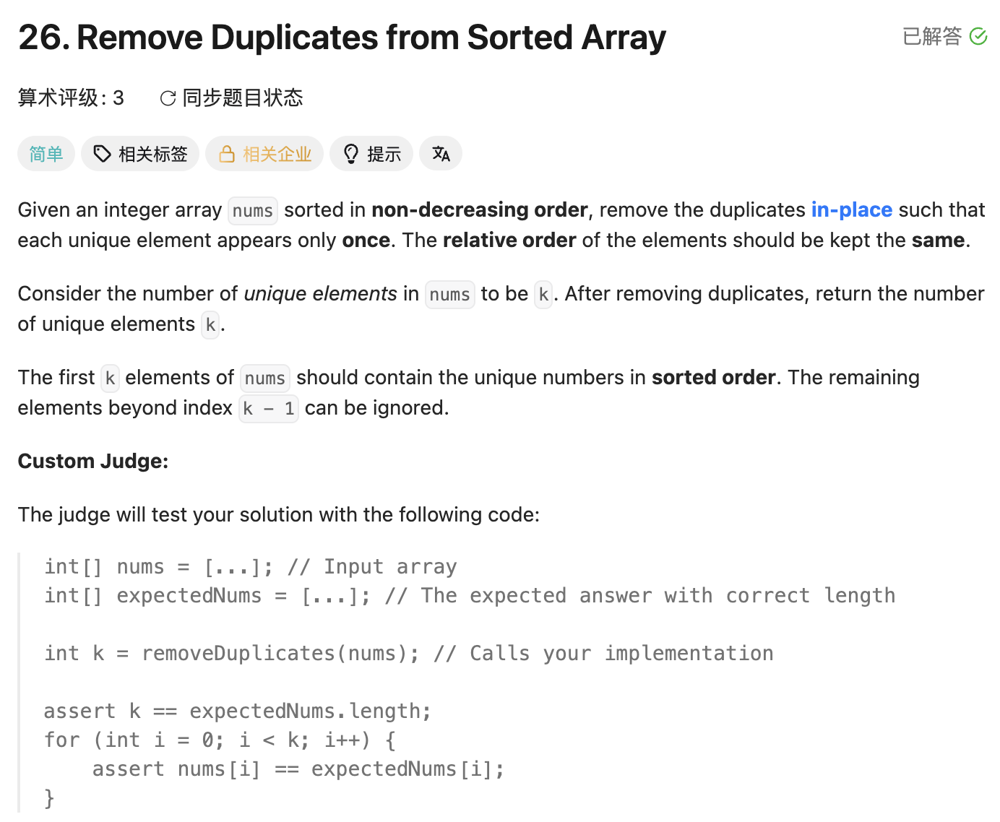

## 26. Remove Duplicates from Sorted Array

Date: 6/14/2025, 7/21/2025, 7/23/2026, 7/28/2026, 8/5/2026
Difficulty: Easy
Tags: two pointers



### 三刷 (7/23/2026) ❌ 比较对象用了 nums[slow]，slow 语义漂成「最后确认位」，return 少 +1

和 27 同天连刷，循环体全对，只错 return。我的代码：

```java
class Solution {
    public int removeDuplicates(int[] nums) {
        int slow = 0;
        for (int fast = 1; fast < nums.length; fast++) {
            if (nums[fast] != nums[slow]) {
                slow++;
                nums[slow] = nums[fast];
            }
        }
        return slow;   // ❌❌ slow 是「最后确认位」的下标，长度=下标+1，漏了 +1
    }
}
```

**根因**：比较对象定了 slow 的语义。拿 `nums[slow]` 比 → 先加后写 → slow 变成下标，return 必须 +1。这和 27「写入位」的语义正相反，连刷时习惯串台了。**改用 `nums[fast-1]` 比，slow 从此锁定「下一个待写入位」**，写后加、slow 即个数，return 不用改——坑从根上填掉，26 此后只用这一种写法。

**自测点**：不看答案说出 ① slow 的 invariant ② 为什么比较对象是 nums[fast-1] 不是 nums[slow] ③ return 为什么不 +1

### 四刷 (7/28/2026) ✅ <8min，历史错误未犯

自测点③干净，②答成"位置不一定相同"（现象层，比"比较对象决定语义"浅一层）。

> 自检信号：注释里把 slow 说成"next valid element"就是语义在往"最后确认位"漂——nums[slow] 是待写入的空槽，不是已处理数据。

### 五刷 (8/5/2026) ✅ <10min，统一模板一次 AC，毕业出清单

---

<!-- ↓↓↓ 复习时先自己想一遍，再往下翻看答案 ↓↓↓ -->

### 正确写法

**slow = 下一个待写入位，[0, slow-1] = 有效区间**，与 27/80 同一套 invariant：

```java
class Solution {
    public int removeDuplicates(int[] nums) {
        int slow = 1;                          // nums[0] 必留，slow 从 1 起步
        for (int fast = 1; fast < nums.length; fast++) {
            if (nums[fast] != nums[fast - 1]) {  // 和原数组邻居比，不碰 nums[slow]
                nums[slow] = nums[fast];       // 合格 → 写 + 推进，成对
                slow++;
            }
        }
        return slow;                           // 写后加，slow 即个数
    }
}
```

k=1 时"第 1 次出现"⇔"和前一个不同"，一次比较够用，不需要 count；k≥2（LC80）才要 count 出场。

### 复杂度分析

**Time: O(n)**：fast 扫一遍，每轮 O(1)。
**Space: O(1)**：只有 slow/fast 两个变量。

### 沉淀

- **移除元素统一模板**：fast 扫描、slow 写入（下一个写入位），比较用原数组邻居或外部值，**永远不用 nums[slow] 判断**。合格=写入+推进成对，不合格=不动。26(k=1)/27(按值)/80(k=2+count) 都是这套
- **比较对象决定 slow 语义**——三刷的错根源在此，换对象直接填坑
- 和 69/34 同族：循环结束后说不清 pointer 语义 → 猜 return → 静默错误

### 关联

- 27（比较对象是外部值 val，slow 天然是写入位）
- 80（k=2 多一个 count；26 的 return 错在 80 一刷同款重现）
- 69 / 34（退出时 pointer 语义决定 return 谁）
