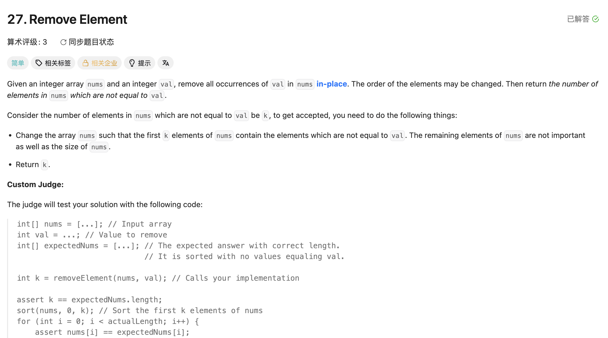

## 27. Remove Element

Date: 一刷(随想录，日期待补), 7/23/2026, 7/28/2026, 7/30/2026, 8/6/2026
Difficulty: Easy
Tags: two pointers
Status: 已毕业 (8/6/2026，7/30 ✅ → 8/6 ✅ +7 站)



### 二刷 (7/23/2026) ❌ 改写循环结构时，无条件动作（pointer 推进）被错误地变成了条件动作

for 版本能 AC，改写成 while 就错了。我的代码：

```java
while (fast >= 0 && fast < nums.length && slow < nums.length) {
    //  ❌② 冗余 condition：fast 只增不减恒 ≥0，slow ≤ fast 恒成立
    //     slow < nums.length 把死循环"救"成了错误返回值，掩盖 bug
    if (nums[fast] == val) {
        fast++;
    } else {
        nums[slow] = nums[fast];
        slow++;
        // ❌① 核心错误：缺 fast++ → fast 卡在第一个非 val element 上
        //    反复复制同一个 element，slow 涨满数组后靠冗余 condition 退出，return nums.length
    }
}
```

**①的根因**：for 头里的 `fast++` 每轮必执行、与分支无关；改写成 while 时把它塞进了 if 分支，只剩一个分支在推进。**for 转 while：update statement 放循环体末尾、所有分支之外。**

---

### 四刷 (7/28/2026) ❌❌ 26 废弃版本的 return 语义回流：slow 是 count 却 +1

循环体全对，只错 return，且判据就写在正上方的注释里。我的代码：

```java
// use fast to scann next valid element      ❌② fast 不判定合格性，判定在 if
// [0, slow-1] is valid interval, k = slow   ← 判据在这，却没被调用
int slow = 0;
for(int fast = 0; fast < nums.length; fast++){
    if(nums[fast] != val){
        nums[slow] = nums[fast];   // 写后加 → slow 恒为「下一个待写入位」
        slow++;
    }
}
return slow + 1;   // ❌❌ 核心错误：slow 已是 count，+1 多算一个
```

**❌❌的根因**：`+1` 来自 26 **三刷时被废弃的那一版**语义——那一版拿 `nums[slow]` 参与比较，slow 被绑架成「最后一个确认位」(index)，长度 = index + 1 所以要 +1。26 三刷后已换成和 `nums[fast-1]` 比、slow 锁定为写入位，`+1` 随之作废。今天它从废弃版本回流到 27。**记住的是「26 要 +1」这个修正动作，不是「slow 是 index 还是 count」这个判据——动作会串台，判据不会。**

和 26 三刷是同一个错的镜像：26 该 +1 而没写，27 不该 +1 而写了。隔 5 天、方向相反 → 不是连刷的工作记忆干扰，是判据本身没固化。

**❌②**：fast 只管扫描，合格与否由中间的 if 判定。把「valid」写进 fast 的注释 = 把判定职责挪到 pointer 身上，和 26 四刷 `slow represent the next valid element` 同族：**pointer 的名字里塞进了它不承担的语义**（283 已自行收敛为 next valid position）。

> **自检信号**：写 return 之前先问「slow 现在是 index 还是 count」。判据只有一条——**看写与加的顺序**：先写后加 → slow 是下一个空位 = count，直接 return；先加后写 → slow 是最后一个确认位 = index，return 要 +1。

**自测点**：① 27 的 slow 起点为什么是 0 而 26 是 1（用「进 loop 前已确认几个」推，不许背 0/1）② 写与加的顺序如何决定 return 要不要 +1

---

### 五刷 (7/30/2026) ✅ 5min 一次 AC

二刷的死循环、四刷的 `return slow + 1` 均未再犯。**自检信号被前置了**——不是写完停一拍回查，而是写注释时就把 `slow also the count` 落在纸上，判据在动手前就在场。

自测点② 走的是**另一条路**：从 invariant 的区间长度推（`[0, slow-1]` 长度 = slow），而非「写与加的顺序」。两把尺子都留——**区间长度那条只能正向推 return，写加顺序那条才能解释 26 三刷为什么该 +1**（那一版先加后写，invariant 根本不是 `[0, slow-1]`）。

---

### 六刷 (8/6/2026) ✅ 毕业站，一次写对

两条 invariant 都在：slow 只在写入时推进、写入判据只看 `nums[fast] != val`，读写分离干净。自测点从 invariant 现推 `return slow`：退出时 slow 是下一个待写入位 → 有效区间 `[0, slow-1]` → 个数 = slow。**判据是从 invariant 读出来的，不是记住的**，四刷那个错已经没有复发的土壤。

遗留小点：注释仍把 slow 写成 `next valid element`，应为 next valid **position**（同上 ❌②）。

---

<!-- ↓↓↓ 复习时先自己想一遍，再往下翻看答案 ↓↓↓ -->

### 正确写法

```java
class Solution {
    public int removeElement(int[] nums, int val) {
        int slow = 0, fast = 0;

        while (fast < nums.length) {       // 和 for 版 condition 完全一致
            if (nums[fast] != val) {
                nums[slow] = nums[fast];
                slow++;
            }
            fast++;                        // 所有分支之外，每轮必执行
        }

        return slow;
    }
}
```

### 复杂度分析

**Time: O(n)**：fast 每轮必进一格，loop 恰好 n 轮，每轮 O(1)。（二刷的 bug 正是破坏了「每轮必进」→ loop 次数失去上界，复杂度分析失效）
**Space: O(1)**：in-place 覆盖，只有 slow/fast 两个 variable。

对比 brute force O(n²)（每删一个 val 整体前移）：two pointers 快在每个 element 最多读一次、写一次。

### 沉淀

- **两条 invariant**：slow 只在写入时推进；写入判据只看 `nums[fast] != val`。读写分离，return 直接从 invariant 读
- **two pointers 高频 bug 模式**：某个分支忘记推进 pointer → infinite loop，或靠其他 condition 意外退出后返回错误结果。结果异常大/异常小时，先检查每个分支里 pointer 是否都在动
- **冗余 loop condition 是坏味道**：不会更安全，只会在出 bug 时掩盖问题（本题 `slow < nums.length` 把死循环掩盖成静默错误）
- 改写循环结构不应改变终止条件

### 引申：for vs while 怎么选

**判断标准：pointer 的推进是否无条件。**

- **每轮必进 → for**。推进写进循环头，语法上保证不会漏（27 的 fast、遍历型 two pointers 的快 pointer）
- **推进与否取决于分支 → while**：binary search（left/right 谁动由比较结果决定，704/69/367）、对撞 pointers（`while (left < right)`，每轮只动一边，LC344/LC977）、sliding window（右用 for、左在内层 while 里条件性收缩）
- **灰色地带**：27 这种「fast 无条件进、slow 条件进」两种都能写，但 for 更防呆——本题的 bug 正是因为 while 把「必执行」交给了人肉保证

### 关联

- 26（同一套模板；三刷的 `+1` 语义正是四刷回流的来源，方向相反）
- 283（同族，pointer 注释语义那条已在 283 收敛）
