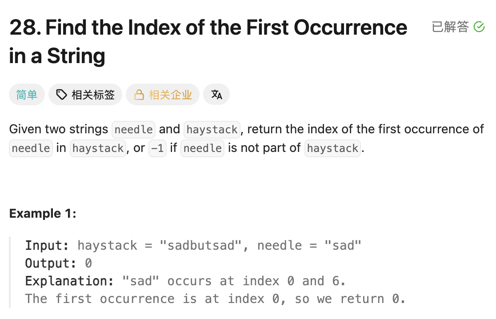

## 28. Find the Index of the First Occurrence in a String

Date: 9/29/2026
Difficulty: Easy
Tags: string, brute force



### 一刷 (9/29/2026) ❌ 思路有了，候选起点与匹配进度混在一起

想用 ans 记录候选起点，完整匹配 needle 后返回，但没有写完：

```java
int ans = 0;
for (int i = 0; i < needle.length(); i++) {
    char c = needle.charAt(i);
    while (i < haystack.length && c != haystack.charAt(i)) {
        // ❌① i 同时表示两个 String 的 index，无法独立变化
        // ❌② String 长度应为 length()
        ans++;
        i++;
        // ❌③ 没有固定候选起点，也没有检查后续字符是否连续匹配
    }
}
```

**根因**：需要独立表达「从哪里开始试」和「已经匹配了几个字符」。原来的 ans 没有固定住起点，i 又同时承担两边的绝对 index，导致匹配过程无法展开。

**讲解后重写**：自行重写成功。理解了 start 固定候选起点，j 表示匹配进度，也是相对起点的 offset：

```text
start = 2

j=0：haystack[2] 对 needle[0]
j=1：haystack[3] 对 needle[1]
j=2：haystack[4] 对 needle[2]
```

两个 String 共享的是 offset，不是绝对 index。本轮先掌握 brute force，KMP 暂不要求独立实现。

> **自检信号**：写比较前，分别指出候选起点和 offset；内层匹配时只推进 offset，失败后才换起点并重置 offset。

**自测点**：某个起点已经匹配了几个字符后失败，能不能直接跳过这几个起点，从失败位置重新尝试？举例说明。

---

<!-- ↓↓↓ 复习时先自己想一遍，再往下翻看答案 ↓↓↓ -->

### 核心思路

**从左到右尝试每个候选起点，固定 start，用 j 连续比较；第一次完整匹配时返回 start。**

### 正确写法

```java
class Solution {
    public int strStr(String haystack, String needle) {
        int n = haystack.length();
        int m = needle.length();

        for (int start = 0; start <= n - m; start++) {
            int j = 0;

            while (j < m
                    && haystack.charAt(start + j) == needle.charAt(j)) {
                j++;
            }

            if (j == m) return start;
        }

        return -1;
    }
}
```

- **`start <= n - m`**：从 start 到末尾至少剩 m 个字符，才值得尝试；等号对应刚好剩 m 个字符。
- **内层 start 不动**：每匹配一个字符，j 加一；`start + j` 与 j 始终对齐。
- **`j == m`**：完整匹配，返回 start。否则尝试下一个 start，j 从 0 重新开始。

起点从小到大尝试，因此第一次成功就是最早出现的位置。若 m>n，外层 loop 不执行，直接返回 -1。

### 复杂度分析

**Time: O((n-m+1) × m)**（n≥m）：最多尝试 n-m+1 个起点，每次最多比较 m 个字符，通常简写为 O(nm)。
**Space: O(1)**：只维护固定数量的 variable。

### 沉淀

- **起点 + offset = 当前 index。** 两段序列起点不同，也可以共享同一个 offset 来对齐。
- **连续匹配遇到不同字符就结束本次尝试。** 不能跳过不匹配字符继续拼，否则检查的就不是 substring。
- **variable 的职责要分开。** start 表示候选起点，j 表示匹配进度；内外层各自推进自己的 variable。

### 关联

- LC844：同样比较两个 String，但 pointer 的推进规则不同。844 会跳过被删除的字符；本题必须从候选起点连续比较。
