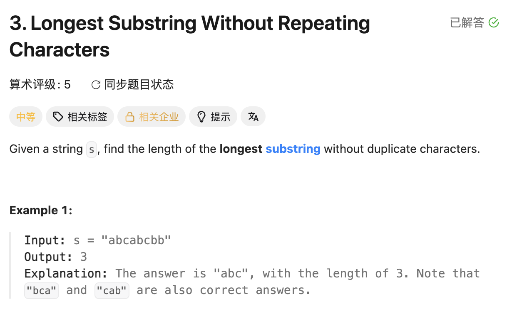

## 3. Longest Substring Without Repeating Characters

Date: 9/18/2026
Difficulty: Medium
Tags: String, Sliding Window, Hash Table



### 一刷 (9/18/2026) ❌ 知道用 sliding window，但实现混淆字符与 index

看解后重写：

```java
Set<Integer> set = new HashSet<>(); // ❌① 存字符，应为 Character

while (set.contains(c)) {
    set.remove(left); // ❌② left 是 index，应移除 s.charAt(left)
    left++;
}
set.add(c);
```

**①的根因**：`c` 是 char，不能直接加入 `Set<Integer>`，`set.add(c)` 会 compile error。

**②的根因**：set 存的是字符，`left` 只是位置。即使改成 `Set<Character>`，`remove(left)` 仍能编译，但查的是 Integer，删不掉对应字符。

理解时还以为遇到 duplicate 要清空 set。实际只需从左边移除到旧的重复字符消失，保留剩余 window。

**自测点**：`"abcb"` 遇到最后一个 b 时，为什么不能清空 set？为什么缩小 window 要用 while，而不是 if？

---

<!-- ↓↓↓ 复习时先自己想一遍，再往下翻 ↓↓↓ -->

### 核心思路（一句话）

**维护不含 duplicate 的 window：重复就缩左边，直到能加入当前字符，再更新最大长度。**

### 正确写法

```java
class Solution {
    public int lengthOfLongestSubstring(String s) {
        Set<Character> set = new HashSet<>();
        int left = 0;
        int ans = 0;

        for (int right = 0; right < s.length(); right++) {
            char c = s.charAt(right);

            while (set.contains(c)) {
                set.remove(s.charAt(left));
                left++;
            }

            set.add(c);
            ans = Math.max(ans, right - left + 1);
        }

        return ans;
    }
}
```

加入当前字符后，set 对应 window `[left, right]`，其中没有 duplicate。

### Dry run：不是清空，而是缩到合法

`"abcb"` 准备加入最后一个 b：

```text
当前 window = "abc"，set = {a, b, c}

移除 a → {b, c}，仍有 b，继续
移除旧 b → {c}，没有 b，停止
加入新 b → {c, b}

新 window = "cb"，长度 2
```

**c 没有造成重复，不需要删掉。** 清空后只剩 `"b"`，会漏掉合法的 `"cb"`。

用 while 是因为旧的重复字符不一定在最左边，移除一次可能不够。

### API 与操作

```java
set.contains(c);           // 判断当前字符是否已在 window 中
set.remove(s.charAt(left)); // 移除左端字符，返回是否删除成功
set.add(c);                // 加入当前字符
```

**pointer 是位置，set 存字符；操作 set 前，先用 charAt(pointer) 取值。**

`remove` 接收 Object，所以传错类型也可能编译通过。`Set<Character>` 中的 `'a'` 不会被 Integer 类型的 index 删除。

### 复杂度分析

**Time: 平均 O(n)**：right 扫描一次，left 也只向右移动；每个位置最多加入、移除各一次。HashSet 操作按平均 O(1) 计。

**Space: O(min(n, Σ))**：Σ 是字符集大小，set 只存当前 window 的不同字符；不固定字符集时可写 O(n)。

### 沉淀

- **substring 必须连续。** 遇到 duplicate，移动 left，不能随意从中间删一个字符后把两边拼起来。
- **只缩到合法，不清空重来。** 保留仍可组成答案的部分。
- **set 随 window 增删。** 它记录当前范围，不是整个 string 出现过的字符。
- **两端都包含，长度为 right - left + 1。**

### 关联

- LC128：set 存整个 array 的不同数值；本题只存当前 window 的字符。
- LC125 / LC680：对撞 pointers 向中间走；本题两个 pointer 都向右走，维护连续 window。
