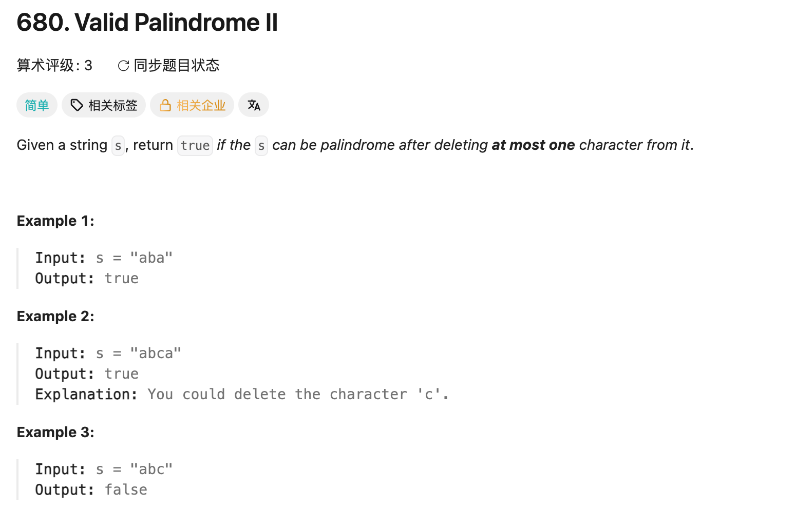

## 680. Valid Palindrome II

Date: 9/18/2026
Difficulty: Easy
Tags: String, Two Pointers



### 一刷 (9/18/2026) ❌ 能列举删除情况，但无法转成代码

**卡在哪**：想分成不删、删头、删尾、删中间，却不知道怎么统一实现。

**真正的坎**：不用按删除位置分类。两端相同就往中间走；第一次不同时，只需尝试跳过左端或右端。helper 检查剩余区间，不再允许删除。

看解后重写：

```java
if (s.charAt(left) != s.charAt(right) { // ❌ 少一个 )
    return isPalindrome(s, left + 1, right)
        || isPalindrome(s, left, right - 1);
}
// ❌ 主函数末尾漏 return true

is (s.charAt(left) != s.charAt(right)) { // ❌ is 应为 if
    return false // ❌ 少分号
}
right-- // ❌ 少分号
```

**漏 return 的含义**：没有遇到不匹配时，原 string 本身就是 palindrome，主 loop 结束后应返回 true。

**自测点**：为什么第一次不匹配时，只需检查跳过左端或右端？为什么不能继续在 helper 中删除？

---

<!-- ↓↓↓ 复习时先自己想一遍，再往下翻 ↓↓↓ -->

### 核心思路（一句话）

**两端相同就继续；第一次不同时，跳过左端或右端，任一剩余区间是 palindrome 即可。**

### 正确写法

```java
class Solution {
    public boolean validPalindrome(String s) {
        int left = 0, right = s.length() - 1;

        while (left < right) {
            if (s.charAt(left) != s.charAt(right)) {
                return isPalindrome(s, left + 1, right)
                    || isPalindrome(s, left, right - 1);
            }

            left++;
            right--;
        }

        return true;
    }

    // 检查 [left, right]，两端都包含，不允许再删除
    private boolean isPalindrome(String s, int left, int right) {
        while (left < right) {
            if (s.charAt(left) != s.charAt(right)) {
                return false;
            }

            left++;
            right--;
        }

        return true;
    }
}
```

### 两个方法里的 pointer 移动各负责什么

- **主函数**：两端相同，移动两个 pointer，检查下一对。
- **helper**：跳过一个字符后，检查整个剩余区间；再遇到不匹配就 false。

例如 `"abca"`：

```text
主函数：a == a → left++、right--
主函数：b != c → 尝试跳过 b，或跳过 c
helper：剩下一个字符，是 palindrome
主函数：return true，直接结束
```

**调用 helper 的分支带着 return，不会再执行主函数下面的 left++、right--。**

若不写主函数的移动，匹配时会一直比较同一对字符，形成 infinite loop。

### 为什么只试左右两端

首次不匹配时，如果只删除区间内部的字符，不同的两端仍然保留，无法成为 palindrome。因此只能尝试删左端或右端。

```java
isPalindrome(s, left + 1, right) // 跳过左端
isPalindrome(s, left, right - 1) // 跳过右端
```

**不用真正删除字符或创建 substring，改变检查边界即可。** `||` 表示任意一种成功即可；第一种为 true 时，不再执行第二种。

### 复杂度分析

**Time: O(n)**：主扫描加最多两次 helper 扫描，总工作量仍为 O(n)。

**Space: O(1)**：没有复制 string，也没有递归调用链。

### 沉淀

- **最多删除一次，也包括不删除。** 主 loop 正常结束就返回 true。
- **主函数允许分支尝试，helper 只检查。** helper 再允许删除，就可能超过一次。
- **看清 return 的位置。** 返回结果后，当前方法结束，不会继续执行下面的 pointer 移动。
- **匹配分支也必须推进 pointer。** 否则 loop 无法结束。

### 关联

- LC125：跳过无效字符后比较；本题字符都有效，只允许跳过一个不匹配端点。
