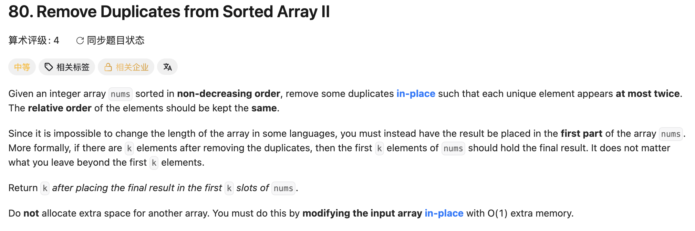

## 80. Remove Duplicates from Sorted Array II

Date: 7/23/2026, 7/24/2026, 7/29/2026, 8/5/2026, 9/24/2026
Difficulty: Medium
Tags: Array, two pointers



### 一刷 (7/23/2026) ❌ 没思路：多重 else if 和 count 两条路都没理顺

先用多重 else if 枚举重复情况，dry run 不对；退回 count 后，仍混淆了 count 的生命周期、比较对象和写入时机。

```java
class Solution {
    public int removeDuplicates(int[] nums) {
        int slow = 0;
        for (int fast = 1; fast < nums.length; fast++) {
            int count = 1;                 // ❌① 每轮重置，最多到 2
            if (nums[slow] != nums[fast]) {
                slow++;                    // ❌③ 缺少写入，新值未搬进结果区
            } else if (nums[slow] == nums[fast]) {
                count++;
                slow++;                    // ❌❌② 重复时也推进，未过滤第三次重复
                if (count >= 3) {
                    nums[slow] = nums[fast]; // ①导致这里成为 dead code
                }
            }
        }
        return slow;                       // ❌④ 此写法停在 last index，少算一个
    }
}
```

**真正的坎**：没先定义 slow 的 invariant。正确框架是：**nums[0..slow-1] 是结果区，slow 指向下一个写入位置**；合格才「写入 + slow++」，不合格只让 fast 前进。

**①的根因**：跨 iteration 累积的 state 必须声明在 loop 外，否则 count 每轮重置。

**②③④的根因**：slow 跟着 fast 走，既没过滤，也没搬运；nums[slow] 又不是稳定的计数参照物。return 差 1 与 LC26 的「index vs count」是同类错误。

反例 `[1,1,1,2,2,3]`：array 未改变，return 5 恰好正确，但前 5 个 element 是 `[1,1,1,2,2]`，不是 `[1,1,2,2,3]`。

**同日二稿的两处 mechanical error：**

```java
if (nums[fast] == nums[fast - 1]) {
    count++;
} else if (nums[fast] == nums[fast - 1]) { // ❌⑤ 重复 condition
    count = 1;                          // 永远无法执行
}
```

另将 `if (count <= 2) {...}` 整块复制两遍，导致每轮写两次、slow +2，最终越界（❌⑥）。

> **自检信号**：count 是否在 loop 外？比较位置是否有明确语义？写入和 slow++ 是否成对且只出现一次？互补分支直接用 else。

---

### 二刷 (7/24/2026) ⚠️ slow 初值写成 0，dry run 自己抓到

框架写对，卡在初始化。

```java
int slow = 0; // ❌① fast 从 1 开始，已保留的 nums[0] 没计入
int count = 1;
for (int fast = 1; fast < nums.length; fast++) {
    if (nums[fast] == nums[fast - 1]) {
        count++;
    } else if (nums[fast] != nums[fast - 1]) { // ② 冗余 condition，用 else 即可
        count = 1;
    }
    if (count <= 2) {
        nums[slow] = nums[fast];
        slow++;
    }
}
return slow;
```

**根因**：count = 1 承认第一个 element 已计入，slow = 0 却表示结果区为空。`[1,1,2]` 会 return 2，而非 3。

> **自检信号**：先数 loop 前已经保留几个 element，再设置 slow；初值必须符合同一个 invariant。

---

### 三刷 (7/29/2026) ⚠️手生 框架全对，卡在比较对象的口述

15min。count 在 loop 外，写入和 slow++ 成对且唯一，互补分支用了 else。

能从初始状态推出 return：slow = 1 表示已经保留一个 element，之后每保留一个就加一，因此结尾直接 return slow。

口答能解释 slow 的 invariant、pointer 之间的间隔和保留 k 次的 condition；解释比较对象时，只答到「slow 和 fast - 1 位置意义不同」，没说清 nums[slow] 为什么不能用于统计输入中的连续重复次数。

**自测点**：count 统计的是哪一段数据？为什么 nums[slow] 不能作为前一个输入值？

---

### 四刷 (8/5/2026) ✅ 一次写对，自测点答到机制层

前三轮的坑没再犯。`count = 1` 手滑写成 `count == 1`，编译期拦下，属于 mechanical error。

口答能说明：sorted 保证重复相邻，但只比较相邻两个值，不能区分当前是第二次还是第三次出现；count 用于累积出现次数。

**另试写位置比较版时出错：**

```java
if (nums[fast] != nums[fast - 2]) { // ❌ fast - 2 不一定仍是原输入值
    nums[slow] = nums[fast];
    slow++;
}
```

反例 `[1,1,1,2,2,3]`：fast = 3 时把 2 写入 nums[2]；fast = 4 时再比较 nums[4] 与 nums[2]，两者都是 2，误删第二个 2。

**根因**：fast - 2 的位置可能已经被覆盖。位置比较版应读取结果区中有明确含义的 nums[slow - 2]，判断是否已经保留两份当前值。

---

### 五刷 (9/24/2026) 代码一次通过，改用 slow - 2 判断

起初想用 count，但没写出来；随后利用 array 的 non-decreasing 性质，正确写出位置比较版，初始化、单独处理短 array、写入及 return 均正确。

讨论 count 思路时，原本想「超过 2 就重置」。澄清后确认：**遇到不同的值才重置，超过 2 后仍继续计数**，否则同一组后面的重复值可能被重新保留。

本次代码无 bug；口答未验证，不据此判定完整 ✅。两种方法都能推广为「每个值最多保留 k 次」。

**自测点**：为什么比较 nums[slow - 2]，而不是 nums[fast - 2]？

---

<!-- ↓↓↓ 复习时先自己想一遍，再往下翻看答案 ↓↓↓ -->

### 方法一：用结果区的位置判断

**nums[0..slow-1] 始终是有效结果；比较 nums[slow-2]，判断结果区是否已有两份当前值。**

```java
class Solution {
    public int removeDuplicates(int[] nums) {
        if (nums.length <= 2) return nums.length;

        int slow = 2;
        for (int fast = 2; fast < nums.length; fast++) {
            if (nums[fast] != nums[slow - 2]) {
                nums[slow] = nums[fast];
                slow++;
            }
        }
        return slow;
    }
}
```

- 相等：结果区倒数第二个已经等于当前值。由有序性可知，最后一个也相等，因此已有两份，跳过。
- 不相等：结果区还没有两份当前值，可以保留。

**这里需要的就是结果区的信息**，因此读取 slow - 2 是有意为之；fast - 2 既不能稳定代表原输入，也不能代表结果区倒数第二个位置。

### 方法二：用 count 统计连续出现次数

**count 记录当前值在输入中连续出现了几次（含自己）；count <= 2 才保留，遇到新值才重置。**

```java
class Solution {
    public int removeDuplicates(int[] nums) {
        if (nums.length <= 2) return nums.length;

        int slow = 1;
        int count = 1;

        for (int fast = 1; fast < nums.length; fast++) {
            if (nums[fast] == nums[fast - 1]) {
                count++;
            } else {
                count = 1;
            }

            if (count <= 2) {
                nums[slow] = nums[fast];
                slow++;
            }
        }
        return slow;
    }
}
```

```text
输入：    1  1  1  1  2
count：   1  2  3  4  1
是否保留：✓  ✓  ✗  ✗  ✓
```

**为什么 nums[fast - 1] 可以用？**

比较发生在本轮写入之前。此前的 iteration 最远只处理到 fast - 1；若曾写入这个位置，也只能是处理它时的自赋值。因此比较时，它仍保留前一个输入值。

本轮写入可能覆盖 fast - 1，但比较已经完成；下一轮需要读取的是本轮的 nums[fast]，它仍保留当前输入值。

### 关键机制：slow 和 fast 之间的间隔

两种方法都遵守同一套写入规则：

- slow == fast：写入是自赋值，无害。
- 第一次跳过：slow 不动，fast 前进，两者拉开间隔。
- 此后 slow 每轮最多加一，fast 每轮加一，间隔不会缩小；保留时需要搬运。

count 版本 dry run：

| fast | count | 动作                | slow（本轮结束） |
| ---- | ----- | ------------------- | ---------------- |
| 1    | 2     | nums[1] = 1，自赋值 | 2                |
| 2    | 3     | 跳过，间隔打开      | 2                |
| 3    | 1     | nums[2] = 2         | 3                |
| 4    | 2     | nums[3] = 2         | 4                |
| 5    | 1     | nums[4] = 3         | 5                |

输入 `[1,1,1,2,2,3]`，结果区为 `[1,1,2,2,3]`，return 5。结果区外的残留值不影响答案。

### 引申：每个值最多保留 k 次

前提仍是 array 有序，k 为正整数。

**count 版本**：将 `count <= 2` 改成 `count <= k`；初始化仍为 slow = 1、count = 1，从 fast = 1 开始。提前返回的 condition 要相应改为 `nums.length <= k`。

**位置比较版**：先保留前 k 个 element，再比较 nums[slow - k]。

```java
public int removeDuplicates(int[] nums, int k) {
    if (k <= 0) return 0;
    if (nums.length <= k) return nums.length;

    int slow = k;
    for (int fast = k; fast < nums.length; fast++) {
        if (nums[fast] != nums[slow - k]) {
            nums[slow] = nums[fast];
            slow++;
        }
    }
    return slow;
}
```

k = 1 对应 LC26，k = 2 对应 LC80。

- count 问：当前值在输入中连续出现了几次？
- slow - k 问：结果区是否已经保留 k 份当前值？

若 array 无序，相同值不再保证相邻，可用 HashMap 统计出现次数。

### 复杂度分析

**Time: O(n)**：一次扫描，每轮 O(1)。
**Space: O(1)**：in-place，只使用常数个 variable。

对比 brute force O(n²)：每次删除后整体前移可能反复搬运；two pointers 让每个 element 最多搬运一次。

### 沉淀

- **先定义 slow 的 invariant**：结果区为 nums[0..slow-1]，slow 同时表示有效长度和下一个写入位置。
- **写入与 slow++ 成对**：保留才推进，跳过不推进。
- **跨 iteration 的 state 放在 loop 外**；count 在遇到新值时重置。
- **比较位置必须有明确语义**：count 读取前一个输入值，位置比较法读取结果区的 slow - k。
- **验证长度，也验证内容**：return 碰巧正确，不能证明结果区正确。

### 关联

- LC26：同一模板，最多保留一次；同样要分清 index 与 count。
- LC27：同属原地过滤，只有保留时才推进 slow。
- LC283：写入后再读取某个位置，要检查其中的值是否仍符合所需语义。
- LC647：同样涉及 loop 中 variable 的作用范围，但具体错因不同。

### Interview pitch

> "Since the array is sorted, I maintain a valid prefix ending just before slow. The first two elements can always stay. For each remaining value, I compare it with nums[slow - 2]. If they are equal, the valid prefix already contains two copies, so I skip it. Otherwise, I write it at slow and advance slow. The final slow is the valid length. This takes O(n) time and O(1) extra space, and generalizes to at most k copies by comparing with nums[slow - k]."
