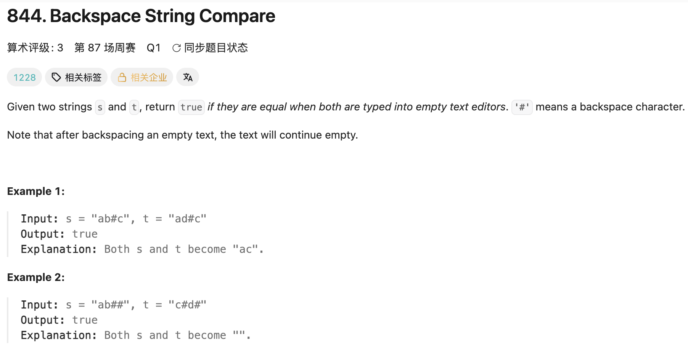

## 844. Backspace String Compare

Date: 一刷(随想录，日期待补), 7/24/2026
Difficulty: Easy
Tags: two pointers, string



### 二刷 (7/24/2026) ❌ 没思路：方向对了（倒序 two pointers + 跳过 #），翻译不成代码

**卡在哪**：知道从两个 string 末尾各起一个 pointer、遇到 # 要"跳过"，但写不出「跳过」对应的代码结构。

**真正的坎**：「跳过 #」不是一个 if 能表达的动作，是一笔**会累积的删除债**——# 自己不算字符、还要吞掉左边下一个幸存字符，且可以连续堆叠（"ab##" 欠两笔债）。需要的不是判断，是**记账 + 清账的小状态机**：skip counter 记债，内层 loop 一直左移边走边清账，直到停在幸存字符上（或出界）。外层每轮只做一件事：两边各自找到下一个幸存字符 → 比较。

**当天重写补记**：框架推导通了之后当天翻译成代码，犯了一个静默错误——「单边出界 → false」的判断写成了字符比较 if 的 else if（挂错宿主）。**else if 的语义 = ¬前面条件 ∧ 自身条件，吸附在哪个 if 上，含义就整个改变**：挂进比较块后它退化成"字符相等就 return false"，dry run "a"/"a" 返回 false 即现形。同时又一处冗余 condition（`!= '#'` 重写了 if 的否定前提），与 LC80 二刷的 `else if(nums[fast] != nums[fast-1])` 同族——**在 else 分支重写前提求安心**的习惯，一天两现。

> **自检信号**：写完任何 if / else if / else 链，逐个分支口头念出它的完整前提（含所有 ¬）；发现自己在 else 里重写前面条件的否定时，停下——那是对 else 语义不信任的信号，删掉冗余，信任结构。

**自测点**：不看笔记，从 brute force 起步推完整条链——(1) 正序重建为什么是 stack 语义（最近的=末尾的）；(2) 追问「倒序扫会怎样」→ 为什么被迫从 pop 换成 skip counter；(3) 追问「何必存串」→ 落笔倒序 two pointers 版（内层三分支 + 外层三情形）。

### 三刷 (7/29/2026) ❌ 结构记住了，三处推进/边界责任掉线

框架一次到位：倒序 two pointers + skip counter 记债清账 + O(1) space，与二刷定稿同构，说明「记账小状态机」这个坎已经过去了。三个 bug 全在把结构落成代码的那一步：

```java
while(i >= 0){
    if(s.charAt(i) == '#'){
        countS++;
        // ❌❌① 漏 i--：'#' 自己也是要跳过的字符。i 不动 → 下一轮读到同一个 '#'
        //      → countS 无限累加 → 遇到任何 # 都死循环
    }else{
        if(countS > 0){ countS--; i--; }
        else break;
    }
}
...
    if(s.charAt(i) != t.charAt(j)) return false;
    // ❌③ charAt 前未查越界：外层是 i >= 0 || j >= 0（或），完全可能 i = -1 而 j >= 0
    //     → StringIndexOutOfBoundsException；且这种情形本身就是「长度不等」的答案
    i--;
    j--;
    return true;   // ❌② 写在 while 体内 → 只比第一对字符就返回；应在 while 之后
                   //    连带：while 后无 return → 编译报 missing return statement
}
```

**①的根因**：`while` 里**每一条不 break 的分支都必须推进 loop variable**。`'#'` 那支只记了债、没走人。二刷的参考代码这三处全是对的——**不是没学会，是照着自己写过的结构重写时掉线**。

**②③的根因**：`return true` 的语义是「所有字符都比完了」，属于**外层循环的终局**，写进体内等于把「一轮」误当成「全程」；③ 同理，外层的 `||` 保证的是「至少一边还有」，不是「两边都有」。两者都是**把某一层的前提当成了另一层的前提**。

**跨题模式（loop 推进责任，两天三形态）**：LC189 7/28——body 里根本不提 loop variable；LC121 7/28——for 头 condition 用了外层的 `i`；LC844 本次——某个分支漏了 `i--`。同一个母题的三种长相。

**关于 `else` 那一支（第三次同款，值得重读二刷笔记）**：三刷时越界检查漏掉，补的时候一度写成裸 `else { return false; }`——那会把「两边都耗尽」（应为 true）和「单边耗尽」（应为 false）压成一支，`s="a#", t="b#"` 即现形（都化简成空串，答案 true）。二刷的定稿写法 `else if (i >= 0 || j >= 0)` 加旁注「勿嵌入」防的正是这个。**二刷是 else if 挂错宿主，三刷是该用 else if 的地方想用裸 else——同一条自检信号的两个反向实例。**

> **自检信号补充**：`if` 条件里含 `&&` / `||` 时，取反后往往不止一种情况——`!(A && B)` 展开是「A假 / B假 / 都假」。此时裸 `else` 会把它们压成一支。**「互补分支用裸 else」（LC80）的前提是真互补，复合条件通常不满足**，要显式写出每支条件。

## **自测点**（沿用二刷那三条追问，另加）：④ 内层 while 的三个分支各自要不要动 `i`、为什么 ⑤ `return true` 为什么必须在外层 while 之后 ⑥ 外层 `||` 保证了什么、没保证什么

<!-- ↓↓↓ 复习时先自己想一遍，再往下翻看答案 ↓↓↓ -->

### 核心思路（一句话）

**倒序 two pointers，各自用 skip counter 清完「删除债」、停在幸存字符上再比较；# 只影响左侧，所以唯有倒序扫不需要额外空间。**

### 代码

### Brute force 版（推导链起点 + string 操作练手）

正序重建两个最终 string 再比较，stack 语义（正序添加 → 「最近的」=「末尾的」→ # 就是 pop 末位）：

```java
class Solution {
    public boolean backspaceCompare(String s, String t) {
        return getString(s).equals(getString(t));   // ⚠️ String 内容比较必须 equals；== 比的是引用（C++ 转 Java 头号坑）
    }

    private String getString(String str) {
        StringBuilder sb = new StringBuilder();     // String immutable，凡「边走边改」必须 StringBuilder（或 char[]）
        for (int i = 0; i < str.length(); i++) {    // length() 带括号是方法；array 的 length 不带括号
            if (str.charAt(i) != '#') {
                sb.append(str.charAt(i));           // 尾部追加 = push
            } else if (sb.length() > 0) {           // guard：债多于人（"##a" 前两个 # 时 sb 为空），空则忽略——没它就越界
                sb.deleteCharAt(sb.length() - 1);   // 删末位 = pop（Java 无 pop_back，这么拼）；O(1) 仅因删的是末位，删中间 O(n)
            }
        }
        return sb.toString();                       // 用完转回 String
    }
}
```

O(n+m) time / O(n+m) space。

**「债多于人」这个 edge case 在两版里的不同归宿**：这里靠 `sb.length() > 0` 显式 guard；倒序版里它表现为扫完 skip 仍 > 0，被 `i >= 0` 的出界条件天然吸收，多余的债自动作废——同一个 edge case，两版用不同机制消化，口述时能追踪它的去向是懂了的标志。

**本版过手的 string API**：`equals` / `charAt` / `length()` / `StringBuilder` 的 `append` / `deleteCharAt` / `toString`。另记：`toCharArray()` 是 String 专属（StringBuilder 没有，需 `sb.toString().toCharArray()` 过桥）；转数组是 O(n) 复制不是取引用，只读一位用 `charAt` 即可。

```java
class Solution {
    public boolean backspaceCompare(String s, String t) {
        int i = s.length() - 1, j = t.length() - 1;
        int skipS = 0, skipT = 0;

        while (i >= 0 || j >= 0) {
            while (i >= 0) {
                if (s.charAt(i) == '#') { skipS++; i--; }   // 记债
                else if (skipS > 0)     { skipS--; i--; }   // 清账：字符被吞
                else break;                                  // 幸存字符，停
            }
            while (j >= 0) {
                if (t.charAt(j) == '#') { skipT++; j--; }
                else if (skipT > 0)     { skipT--; j--; }
                else break;
            }
            if (i >= 0 && j >= 0) {                  // 都停住 → 比字符
                if (s.charAt(i) != t.charAt(j)) return false;
            } else if (i >= 0 || j >= 0) {           // 单边出界 → 长度不等
                return false;                        // （此 else if 与上面的 if 并列，勿嵌入）
            }
            i--; j--;
        }
        return true;                                 // 双双出界 → 全部通过
    }
}
```

### 复杂度分析

**Time: O(n+m)**：i、j 各自单调左移不回头，每个字符至多访问一次。
**Space: O(1)**：两个 pointer + 两个 counter。

对比 brute force O(n+m) time / O(n+m) space（StringBuilder 各自重建最终 string 再 equals；`deleteCharAt(末位)` 是 O(1)，删中间才是 O(n)）：时间同阶，倒序版的全部价值是把空间压到 O(1)——面试 follow-up "能不能 O(1) space" 要的就是它。

### 引申：从 brute force 到 O(1) 的两次追问

1. **正序重建**（stack 语义）：正序添加 → 「最近的」=「末尾的」→ `#` 就是 pop 末位。O(n+m) time / O(n+m) space
2. 追问一「倒过来扫会怎样」→ 先见 # 后见字符，没东西可 pop → **被迫改记账**：skip counter 记债、遇幸存字符清账。仍 O(n+m) space（串照建，且 build 出的是反串——用于比较无妨，要输出需 reverse）
3. 追问二「既然只是比较，何必存串」→ 丢掉 StringBuilder，双 pointer 当场比 → **O(1) space**

可迁移判断：**当操作只影响单侧（# 只删左边）时，从另一侧扫常能省掉辅助结构**（同族：LC88 从后往前填）。面试口述按 1→2→3，两个追问自己说出来，比直接甩最优解加分。

### 关联

- 26/27/80/283（同为 two pointers，但**不同族**：那族是单 array 上 fast/slow 读写分工、维护 [0, slow-1] invariant、单层 loop 一步一格；本题是双序列各一 pointer 只读比对，推进单位是「下一个幸存字符」→ 内层 loop 跨垃圾由此而来，终局是双边出界组合三情形）
