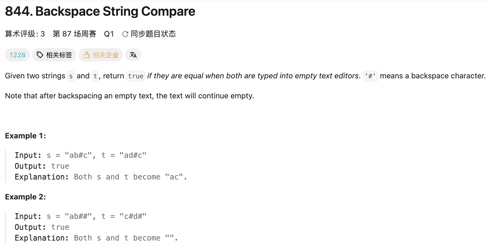

## 844. Backspace String Compare

Date: 一刷（随想录，日期待补）, 7/24/2026, 7/29/2026, 8/6/2026, 8/8/2026（攻坚）, 8/13/2026, 9/29/2026
Difficulty: Easy
Tags: two pointers, string



### 二刷 (7/24/2026) ❌ 方向对了，写不出跳过字符的结构

**卡在哪**：知道用倒序 two pointers，但不知道怎么处理连续的 `#`。

**根因**：`#` 不能简单理解成「跳两格」。需要用 skip counter 记录还要删除几个普通字符；遇 `#` 就累加，遇需要删除的普通字符才减一。

**当天重写的两个错**：

- 把「单边耗尽 → false」挂在字符比较的 `else if` 上，变成「字符相等就返回 false」，`"a"` / `"a"` 即可暴露。
- 在 `else` 中重复判断 `!= '#'`；前一个分支已经排除了 `#`。

---

### 三刷 (7/29/2026) ❌ 漏推进、提前返回、未检查 index

```java
while (i >= 0) {
    if (s.charAt(i) == '#') {
        countS++;
        // ❌❌① 漏 i--：反复读取同一个 #，形成 infinite loop
    } else {
        if (countS > 0) {
            countS--;
            i--;
        } else {
            break;
        }
    }
}
...
    if (s.charAt(i) != t.charAt(j)) return false;
    // ❌③ 未检查 index：可能只有一边还有字符
    i--;
    j--;
    return true; // ❌② 在外层 while 内，只比较一对字符就返回
}
```

**根因**：没有分清各层的责任。内层负责找到有效字符，外层负责逐对比较；一对相等不能代表全部相等，外层的 `||` 也不保证两个 index 都合法。

补检查时曾想用裸 `else { return false; }`，但这会把「两边都耗尽」也判成 false，例如 `"a#"` / `"b#"`。

> **自检信号**：每条继续执行的路径是否推进？每个 `charAt` 是否有合法 index？`return true` 是否已经覆盖全部比较？

---

### 四刷 (8/6/2026) ❌ 看笔记提示写，仍把 count == 0 划进删除分支

本轮依赖笔记提示，不算独立通过。

```java
while (i >= 0) {
    if (s.charAt(i) == '#') {
        countS++;
        i--;
    } else if (countS >= 0) { // ❌❌ 应为 countS > 0
        countS--;
        i--;
    } else {
        break;
    }
}
```

**根因**：`countS == 0` 表示没有待删除字符，此时应保留当前普通字符。`>= 0` 却把它跳过，并把 counter 减成 -1。

反例：`"ab"` / `"ac"` 中，`b`、`c` 被跳过，只比较 `a`，误判 true。与 LC34 的 `<` / `<=` 同族：等号没有对应到正确的语义。

> **自检信号**：写 counter 的 condition 时，单独代入 0，问这一刻该删还是该留。

---

### 五刷 (8/13/2026) ⚠️手生 代码一次写对，口答收窄后说清原因

`countS > 0` 已改对；两侧对称，`else break` 不移动 pointer，比较后统一推进。`"a#"` / `"b#"`、`"a#c"` / `"b"`、`"#"` / `""` 等 edge case 均通过。

**口答**：能立即说明三个分支，并指出第二支隐含「当前不是 `#`」。但解释为什么 `break` 前不能 `i--` 时，先答成了 scope 和内外层分工；收窄到具体位置后，独立说明：

- 左移会跳过本该参与比较的有效字符。
- 若原本 i=0，左移后会被误当成这一边已耗尽。

因果链能独立说出，但需要收窄问题，记 ⚠️手生。

---

### 六刷 (9/29/2026) ❌ 能说出整体流程，但找有效字符的 loop 没有正确推进和停止

第一反应是倒序 two pointers：分别找到当前有效字符，再比较。外层 `||` 正确，错误集中在内层结构。

```java
while (i >= 0) {
    while (s.charAt(i) == '#') countS++;
    // ❌① i 没动：一直读同一个 #

    while (countS > 0) {
        i = i - 2; // ❌② 不能把一个 # 和一个普通字符当成固定两格
        countS--;
    }

    char a = s.charAt(i);
    // ❌③ i 可能已为负；即使合法，也没有推进或 break
}
// t 侧同样声明 char b

if (a != b) return false;
// ❌④ a、b 声明在各自内层 block 中，这里超出 scope
```

**根因**：把「收集 `#`」与「删除普通字符」当成两个一次走完的阶段，但扫描中会反复遇到新的 `#`。每移动一格，都需要重新识别当前字符；找到有效字符后则应停住，交给外层比较。

讨论后选择 `while + if / else if / else`：每轮只处理一个字符。多个 while 也能写对，但删除阶段遇到新 `#` 时必须切回收集阶段。

同时厘清：`break` 只退出最近的 loop，不改变 `i`；`i` 在外层声明，出来后仍可使用，但能否调用 `charAt(i)` 还要检查 `i >= 0`。不再额外存 `a`、`b`。

> **自检信号**：内层每轮只做两种事之一——消耗一个字符并左移，或保留有效字符并退出；出来后先检查两边是否都有字符，再比较。

**自测点**：外层 `while (i >= 0 || j >= 0)` 改成 `&&`，会漏掉哪类输入？给一个反例并说明原因。

本轮尚未重新独立写出完整代码，不记通过。

---

<!-- ↓↓↓ 复习时先自己想一遍，再往下翻看答案 ↓↓↓ -->

### 核心思路

**从右往左扫描，先遇到 `#`，再遇到它要删除的字符。用 skip counter 找到两边下一个有效字符，直接比较，无须重建 String。**

### 代码

```java
class Solution {
    public boolean backspaceCompare(String s, String t) {
        int i = s.length() - 1, j = t.length() - 1;
        int countS = 0, countT = 0;

        while (i >= 0 || j >= 0) {
            while (i >= 0) {
                if (s.charAt(i) == '#') {
                    countS++;
                    i--;
                } else if (countS > 0) {
                    countS--;
                    i--;
                } else {
                    break; // 保留有效字符，交给外层比较
                }
            }

            while (j >= 0) {
                if (t.charAt(j) == '#') {
                    countT++;
                    j--;
                } else if (countT > 0) {
                    countT--;
                    j--;
                } else {
                    break;
                }
            }

            if (i >= 0 && j >= 0) {
                if (s.charAt(i) != t.charAt(j)) return false;
            } else if (i >= 0 || j >= 0) {
                return false; // 只有一边还有有效字符
            }

            i--;
            j--;
        }

        return true;
    }
}
```

内层结束后，pointer 要么停在有效字符上，要么已小于 0。外层统一处理：

- 两边都有字符：比较。
- 只有一边有字符：返回 false。
- 两边都没有字符：比较完成。

多余的 `#` 不需要额外处理：pointer 扫到负数后，即使 counter 仍大于 0，也已经没有字符可删。

### 复杂度分析

**Time: O(n+m)**：两个 pointer 只向左移动，每个字符只处理常数次。
**Space: O(1)**：只维护两个 pointer 和两个 counter。

### Brute force：正序重建后比较

用 StringBuilder 模拟 stack：普通字符追加到末尾，遇到 `#` 就删除末位；为空时忽略。

```java
class Solution {
    public boolean backspaceCompare(String s, String t) {
        return getString(s).equals(getString(t));
    }

    private String getString(String str) {
        StringBuilder sb = new StringBuilder();

        for (int i = 0; i < str.length(); i++) {
            if (str.charAt(i) != '#') {
                sb.append(str.charAt(i));
            } else if (sb.length() > 0) {
                sb.deleteCharAt(sb.length() - 1);
            }
        }

        return sb.toString();
    }
}
```

**Time: O(n+m)，Space: O(n+m)。** 倒序版保持同阶时间，并省去重建结果的空间。

API 提醒：

- String 内容比较用 `equals`，不用 `==`。
- String / StringBuilder 用 `length()`，array 用 `length`。
- StringBuilder 的 `deleteCharAt` 删除末位为 O(1)，删除中间位置需要移动后续字符。
- 只读一个字符用 `charAt`，无须转 array；StringBuilder 若需转 array，可用 `sb.toString().toCharArray()`。

### 沉淀

- **counter 数的是待删除的普通字符，不是 pointer 要移动的格数。** 遇 `#` 累加，遇需要删除的普通字符才减一。
- **定位与比较后的推进分开。** 内层找到有效字符就停，外层比较后才跳过它。
- **scope 合法与 index 合法是两回事。** variable 在外面能用，不代表它的值能直接用于 `charAt`。
- **复合 condition 的 else 可能包含多种情况。** 「不是两边都有」还要区分单边耗尽和两边都耗尽。
- **选择能减少切换判断的结构。** 本题两种字符会交替出现，每轮重新分类，比维护两个处理阶段更直接。

### 引申：从重建到直接比较

正序处理需要保存已经留下的字符；倒序处理可以先累计待删除数量。进一步看，题目只要求判断相等，不要求输出结果，因此找到有效字符后直接比较即可。

**操作只影响一侧时，尝试从另一侧处理；只需要比较结果时，检查是否真的需要存下结果。**

### 关联

- LC34：四刷的 `>= 0` 与 `<` / `<=` 同属等号的语义判断。
- LC26 / LC27 / LC80 / LC283：同为 two pointers，但它们主要负责单个 array 的读写；本题是两个 String 各自定位后比较。
- LC88：从后往前处理，可以避免额外保存或覆盖尚未处理的数据。
