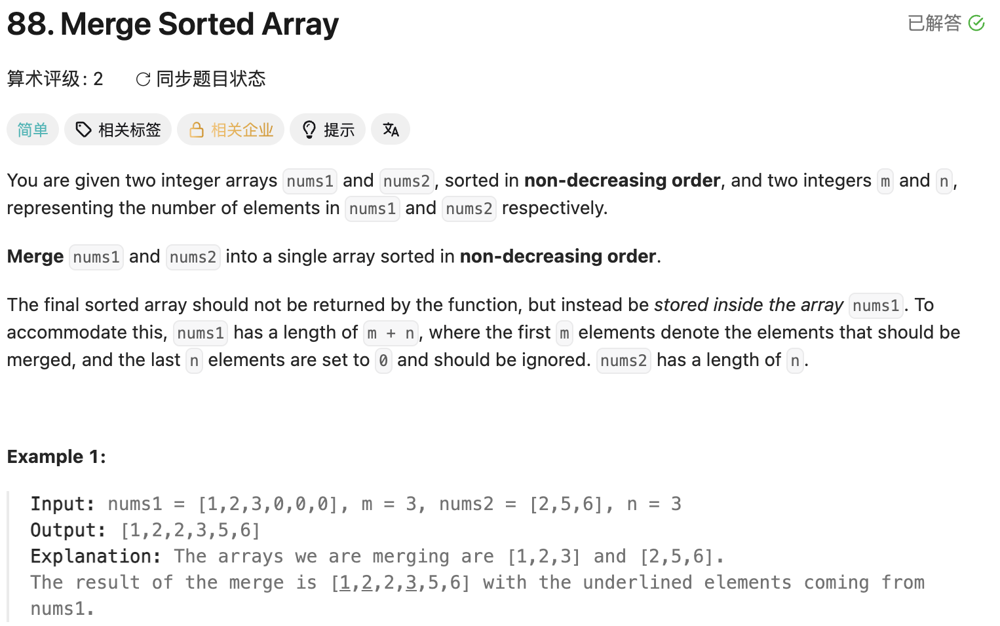

## 88. Merge Sorted Array

Date: 一刷（日期待补）, 9/22/2026, 9/23/2026
Difficulty: Easy
Tags: Array, Two Pointers, Sorting



### 一刷（日期待补）

用两个先后执行的 while loops 写对，但对「为什么只处理 nums2 的剩余部分」半懂不懂。

---

### 二刷 (9/22/2026) ❌ 忘记 backward merge，混淆访问条件与结束条件

**卡在哪**：先想到插入，但插入会反复搬动有效 elements；提示「最大值」后，才想到利用末尾空位，从后往前填。

**真正的坎**：没分清「这一侧还能不能取」和「整个合并能不能结束」。

#### ① 复制 + sorting：初始化和移动没对应起来

```java
if (nums2.length = null) return; // ❌ length 是 int；= 是 assignment
for (int i = m - 1; i < nums1.length; i++) { // ❌ 第一个空位是 m
    int j = 0; // ❌ 每轮重置
    while (j <= nums2.length - 1) {
        nums[i] = nums[j]; // ❌ 应为 nums1[i] = nums2[j]
        j++; // ❌ i 不动，反复覆盖同一格
    }
}
Arrays.sort(nums1);
```

删掉内层 while 后，仍把 `int j = 0` 留在 loop 内 → 每轮都复制 nums2[0]。

**根因**：跨 iteration 保留的 pointer 要在 loop 外初始化；每复制一个 element，读取和写入位置都要推进。

#### ② pointer 变了，提前取出的值不会跟着变

```java
int l = m - 1, r = n - 1;
int a = nums1[l]; // ❌ m=0 时越界；l-- 后 a 不会更新
int b = nums2[r]; // ❌ n=0 时越界；r-- 后 b 不会更新

for (int i = nums1.length; i >= 0; i--) { // ❌ 应从 length-1 开始
    if (a > b) {
        nums1[i] = a;
        l--;
    } else if (b >= a) { // 冗余：直接 else 即可
        nums1[i] = b;
        r--;
    }
}
```

**根因**：a、b 保存的是当时的 int 值，不与 pointer 绑定。每轮先检查 pointer，再读取当前候选。

例如 `[1,4,0,0]` 与 `[2,3]`：修正写入起点后，取走 4，l 已移动，但 a 仍是 4 → 下一轮又填 4。

#### ③ nested loops：写入 pointer 移动得太晚

```java
for (int i = nums1.length - 1; i >= 0; i--) {
    while (r >= 0) {
        if (nums1[l] > nums2[r]) { // ❌ l 可能已为 -1
            nums1[i] = nums1[l];
            l--;
        } else {
            nums1[i] = nums2[r];
            r--;
        }
    } // ❌ 内层结束后才执行 i--，期间一直覆盖同一格
}
```

**根因**：每填一格就要移动写入 pointer；两个 loops 先后执行和嵌套执行，移动时机不同。

#### ④ 核心错误：防止越界，不等于完成合并

```java
r >= 0 && l >= 0 // ❌ 若这是唯一的 loop，会漏掉 nums2 的剩余部分
```

**反例 dry run**：`nums1=[4,0], nums2=[2]`。取 4 后得到 `[4,4]`，l=-1、r=0 → loop 结束，2 没写进去。

**根因**：nums1 用完只代表不能再比较两边，nums2 可能仍需搬入；没有越界也可能产生静默错误。

---

### 三刷 (9/23/2026) ❌ 思路能独立提取，boundary 检查没有放在取值之前

开头顺利想到 backward merge，并自己用 `[4,0]`、`[2]` dry run，发现 l 用完后仍在读取 nums1[l]。

#### ① 只保证一侧有效，却读取两侧

```java
int l = m - 1, int r = n - 1, int k = m + n - 1;
// ❌ 同一条 declaration 只写一次 int

while (l >= 0 || r >= 0) {
    while (r >= 0 && nums1[l] < nums2[r]) { // ❌ 未保护 l
        nums1[k] = nums2[r];
        r--;
    }
    while (l >= 0 && nums1[l] >= nums2[r]) { // ❌ 未保护 r
        nums1[k] = nums1[l];
        l--;
    }
    // ❌ 每次写入后都缺 k--，反复覆盖同一格
}
```

**根因**：`||` 只保证至少一边有候选；比较两边需要两边都有效。每轮只需选择一边、填一格，不需要 nested loops。

#### ② ❌❌ 核心错误：先取值，后检查是否能取

```java
if (nums1[l] >= nums2[r]) {      // ❌❌ pointer 为 -1 时，这里已越界
    nums1[k] = nums1[l];
    l--;
} else if (nums1[l] < nums2[r]) {
    nums1[k] = nums2[r];
    r--;
} else if (r < 0) {             // ❌ 检查太晚，无法保护前面的访问
    break;
} else {                       // ❌ else 不会捕获前面的 exception
    nums1[k] = nums2[r];
    r--;
}
k--;
```

**反例 dry run**：`nums1=[4,0], nums2=[2]`。第一轮取 4，l=-1、r=0、k=0；外层继续，下一轮第一个 if 就读取 nums1[-1] → 越界，根本走不到后面的检查。

**根因**：branch 从上往下执行，必须先排除 pointer 无效的情况，再取值比较；两边有效时，`>=` 与 `<` 也已覆盖所有情况。

**本轮理解**：最终选定两个先后执行的 while。已能自己解释：两边都有候选才比较；nums2 剩余要搬入，nums1 剩余留在原位。尚未提交该版本的独立重写代码，不记为一次写对。

**自测点口答**：为什么只补 nums2 的剩余部分？已用自己的话解释通过；本题已讲穿，不再用同一问题作下次独立验收。

---

<!-- ↓↓↓ 复习时先自己想一遍，再往下翻看答案 ↓↓↓ -->

### 正确写法

**两边都有就比较，nums2 剩下就搬。固定用两个先后执行的 while。**

```java
class Solution {
    public void merge(int[] nums1, int m, int[] nums2, int n) {
        int l = m - 1;
        int r = n - 1;
        int k = m + n - 1;

        while (l >= 0 && r >= 0) {
            if (nums1[l] >= nums2[r]) {
                nums1[k] = nums1[l];
                l--;
            } else {
                nums1[k] = nums2[r];
                r--;
            }
            k--;
        }

        while (r >= 0) {
            nums1[k] = nums2[r];
            r--;
            k--;
        }
    }
}
```

**为什么从后往前填不会覆盖未处理的数据？**

始终有 `k = l + r + 1`。r≥0 时，k>l，写入位置在 nums1 尚未处理部分的右侧。

**为什么 nums1 剩余部分不用搬？**

nums2 用完时 r=-1，因此 k=l：下一个写入位置就是 nums1 剩余部分的末尾，它们已经在正确位置。

### 复杂度分析

**Time: O(m+n)**：每轮放好一个 element，最多处理 m+n 个。
**Space: O(1)**：只用三个 pointers，in-place。

对比复制后 sorting 的 O((m+n) log(m+n))：利用已有顺序，省去重新 sorting。

### 沉淀

- **先检查，再取值**：检查必须位于危险访问之前；else 不会捕获 exception。
- **pointer 为 -1 本身不报错**：它表示该侧用完，继续访问 array[pointer] 才会越界。
- **继续条件与取值条件分开想**：某一侧用完，可能需要切换处理方式，不一定结束。
- **初始化、取值、移动分别检查**：pointer 初始化一次；候选每轮重读；每填一格，移动来源 pointer 和写入 pointer。

> **自检信号**：写下 array[p]，先找保证 p 合法的 condition；看到 p--，检查下一次读取是否仍被保护。最后 dry run：m=0、n=0、单个 element、两侧分别先用完。

### 引申：break / continue

- **break**：退出最近一层 loop；不会只退出 if。
- **continue**：跳过本轮剩余代码；while 回到 condition，普通 for 先执行 update statement。
- **return**：结束整个方法。

在 `while (l >= 0 || r >= 0)` 中，若 r<0 时 continue，且 l≥0、所有 pointers 都不更新，就会形成 infinite loop。本题固定版本不需要这两个关键字。

### 关联

- LC704：同样先确认合法 index，再访问 array；length 不是最后一个合法 index。
